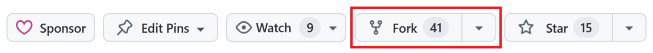
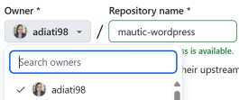
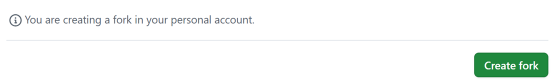
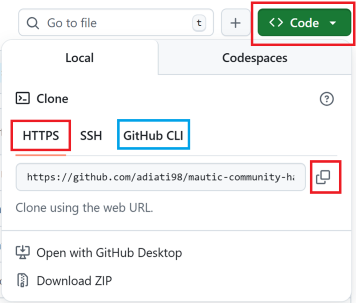
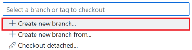
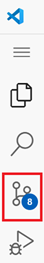
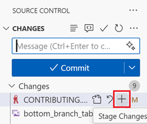
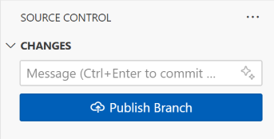
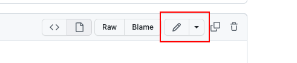

# Contributing to Mautic Community Handbook

Contributions are always welcome, no matter how large or small, or at whatever skill level you are. Before contributing, please read the [Code of Conduct](https://mautic.org/code-of-conduct/) and follow the directions in this guide.

---

## Table of Contents

- [Communication expectation](#communication-expectation)
- [Issues](#issues)
- [Pull requests (PRs)](#pull-requests-prs)
  - [Before submitting a PR](#before-submitting-a-pr)
  - [Submitting a PR](#submitting-a-pr)
  - [After submitting a PR](#after-submitting-a-pr)
- [Contributing workflow](#contributing-workflow)
  - [Forking the repository](#forking-the-repository)
  - [Clone the repository](#clone-the-repository)
  - [Create a new branch](#create-a-new-branch)
  - [Push changes to the remote repository](#push-changes-to-the-remote-repository)
  - [Create a PR](#create-a-pr)
- [Getting started](#getting-started)
  - [1. On GitHub](#1-on-github)
  - [2. GitHub Codespaces](#2-github-codespaces)
    - [Setting up a codespace](#setting-up-a-codespace)
    - [Live preview on codespace](#live-preview-on-codespace)
  - [3. Local development](#3-local-development)
    - [Prerequisite](#prerequisite)
    - [Setting up local environment](#setting-up-local-environment)
- [Working with links](#working-with-links)
  - [Create a new link](#create-a-new-link)
  - [Check broken links](#check-broken-links)
- [Working with Vale](#working-with-vale)
- [Credit](#credit)

---

## Communication expectation

1. Always leave a detailed description in the pull request (PR). Leave nothing ambiguous for the reviewers.
2. Provide screenshots for visual changes.
3. Always review your code first. Be sure to run the project locally and test it thoroughly before requesting a review.
4. Communicate in the GitHub repository first before Slack. Whether it's in the issue or the PR, keeping the lines of communication open and visible to everyone on the team helps everyone around you.

## Issues

- When you contribute to the project for the first time, please consider checking the [good first issue](https://github.com/mautic/mautic-community-handbook/issues?q=is%3Aissue%20state%3Aopen%20label%3A%22good%20first%20issue%22) or [help wanted](https://github.com/mautic/mautic-community-handbook/issues?q=is%3Aissue%20state%3Aopen%20label%3A%22help%20wanted%22) labels.

- If you wish to work on an open issue, please comment on the issue, and a maintainer will assign it to you.

  If an issue isn't assigned, it's assumed to be available for anyone to work on. So, ensure that you're assigned to an issue **before** beginning work to avoid conflicts.

  **Note:** Please don't ask maintainers to assign you to another issue before you have finished working on yours and created a PR.

- Did you spot a bug or have an idea for enhancing the Mautic Community Handbook? You can [create an issue](https://github.com/mautic/mautic-community-handbook/issues/new?q=is%3Aissue+state%3Aopen+label%3A%22help+wanted%22) to address it.

  However, the Education Team needs to triage the issue before you can work on it. If you wish to work on the issue you submitted, please inform and tag the `@mautic/education-team-leaders` in the comment.

## Pull requests (PRs)

PRs are always welcome. However, before working on changes, you must ensure that **you are assigned** to an existing issue and **link your work to the issue in your PR**.

### Before submitting a PR

1. Ensure that you work on your changes in a new branch on your fork. Create one branch for each task you work on.
2. Run and check your changes locally. Ensure that everything functions as intended.

### Submitting a PR

1. Ensure that you address one issue in one PR. If you work on multiple issues, work on them separately and create one PR to address each issue.
2. Make sure you give clear information about your changes in your PR:

   - **A title**. The PR title must describe your changes. For example: `Convert Marketer section into RST`.
   - **A description**. A clear description can help PR reviewers understand what kind of changes you made in your PR. It's always good to walk through the process of how a reviewer can test your changes. See an example in #369.
   - **A related issue**. [Link the issue number](https://docs.github.com/en/issues/tracking-your-work-with-issues/linking-a-pull-request-to-an-issue) that you worked on and add a keyword of 'Closes', 'Fixes', or 'Resolves' in front of it. For example, `Closes #123`, `Fixes #234`, etc. You can find the issue number right next to the issue's title. Linking the issue number automatically closes your issue once your PR gets merged.

3. Provide screenshots for visual changes if necessary.

### After submitting a PR

1. Ensure that all checks pass. If you see the linting build or prose failed, try to debug and fix it until all of them pass. If you have questions or need help, feel free to tag the `@mautic/education-team-leaders` in the comment.
2. Please don't DM maintainers on Slack to review or ask feedback and questions about your PR.

   If you'd like feedback or ask questions about your PR, tag `@mautic/education-team-leaders` in the comment of your PR or use the `#t-education` channel on Slack. That way, not only maintainers, but the community can help you get unstuck. The team always gets a notification whenever there is an incoming PR. If you haven't received a review within a week, you can tag them in the PR comments to ask for an estimated review time.

3. Keep your branch up to date while waiting for review.
4. Respond and address the reviewer's feedback. Please don't request a review until you've addressed all feedback.

## Contributing workflow

In this section, you can find the contributing workflow and best practices for contributing to this project.

### Forking the repository

Forking this repository is the first thing you need to do before anything else. Fork means make a copy of a repository to your GitHub account.

To fork this repository:

1. In the main page of [mautic/mautic-community-handbook](https://github.com/mautic/mautic-community-handbook), click the 'Fork' button at the top.

   

2. Choose your username in the 'Choose the owner' dropdown menu. Do not select a company here; always choose your personal account — otherwise, maintainers can't collaborate and fix things for you on your PR.

   

3. Click the green 'Create fork' button at the bottom.

   

### Clone the repository

After you forked the repository, you need to clone it. Cloning means making a copy of a repository in your local environment. In this case, you want to clone your forked repository.

Follow the steps below to clone your forked repository:

1. Click your avatar on the top right.
2. Click 'Repositories'.

   

3. Open your forked mautic-community-handbook repository. The URL should have your username. For example: `https://github.com/USERNAME/mautic-community-handbook`.
4. Click the green 'Code' button on top.
5. Select 'HTTPS' and copy the URL if you work with traditional Git, or select 'GitHub CLI' and copy the command if you work with [GitHub CLI](https://cli.github.com) (recommended - it makes commands much easier to remember!)

   

6. In your terminal, go to your local directory where you want to save this project.
7. If you work with GitHub CLI, paste the command and hit enter. For traditional Git, run the command below and hit enter:

   ```bash
   git clone https://github.com/USERNAME/mautic-community-handbook
   ```

### Create a new branch

Before working on changes, ensure that you create a new branch and work on this branch. You don't want to directly work on the default — such as `main` — or any other base branch, because you won't be able to work on lots of things at the same time. If you make all those changes on one branch, it's not possible to separate them out and only merge one change at a time.

There are two ways to create a new branch:

1. **With Git Source Control in VS Code**

   Working with [Git source control](https://code.visualstudio.com/docs/sourcecontrol/overview?originUrl=%2Fdocs%2Fsourcecontrol%2Fintro-to-git) in VS Code is more comfortable if you're not technical and prefer a Graphical User Interface (GUI) over a terminal.

   To create a new branch with Git source control:

   1. Click the 'main' branch tab at the bottom left. It opens a dropdown menu at the top.

      

   2. Click 'Create new branch...'

      

   3. Type the branch name with anything you like. Preferably, it reflects your changes, for example, `fix-typo`.

   4. Hit enter.

2. **On terminal**

   If you prefer working with the terminal, run the following command:

   ```bash
   git checkout -b YOUR-BRANCH-NAME
   ```

### Push changes to the remote repository

If you have finished with your changes, you can push them to the remote repository to create a PR. Push means moving your commits from your local to the remote repository.

There are two ways to push your changes to the remote repository:

1. **With Git Source Control in VS Code**

   1. On the left panel, click the 'Source Control' — resembles the git branches icon.

      

   2. Click the '+' icon next to the name of the file to move it to the 'stage' phase. It means you're adding this file as 'ready' to commit.

   3. After you add all the files that you want to commit, add a commit message describing the changes you made. For example, `fix broken links`.

   4. Click the 'Commit' button.

      

   5. Click the 'Publish Branch', which opens a dropdown menu.

      

   6. Select `origin: <YOUR-FORKED-REPOSITORY-URL>`.

      

2. **On terminal**

   1. Run `git status`. It gives you file paths of the files that you've worked on. You can later copy these paths for the next step.
   2. Add the file path(s) that hold your changes to the 'stage' phase by running this command:

      ```bash
      git add file-path-1 file-path-2
      ```

   3. Commit your changes with this command:

      ```bash
      git commit -m "your message"
      ```

      Change `your message` to briefly describe your changes. For example, `fix broken links`.

   4. Push your changes to the remote repository:

      ```bash
      git push -u origin YOUR-BRANCH-NAME
      ```

### Create a PR

Once you've pushed your changes, you are ready to create a PR. To do so:

1. Go to [https://github.com/mautic/mautic-community-handbook](https://github.com/mautic/mautic-community-handbook) and a green button prompts you to create a PR.

2. Fill in the PR template. Please read the "[Submitting a PR](#submitting-a-pr)" section for all the information you need to include in your PR for the reviewers.

3. Submit it for review.

## Getting started

This project is built with [Sphinx](https://www.sphinx-doc.org/en/master/) and hosted on the [Read the Docs platform](https://readthedocs.org). The contents are written in [reStructuredText (RST)](https://www.sphinx-doc.org/en/master/usage/restructuredtext/index.html).

There are three ways to work on changes for the Mautic Community Handbook:

1. Directly on GitHub
2. With [GitHub Codespaces](https://github.com/features/codespaces) on your browser
3. With code editor, such as [VSCode](https://code.visualstudio.com/), on your local machine — **recommended**

### 1. On GitHub

Making changes directly on GitHub is suitable for minor changes, such as fixing a typo. For bigger and more complex changes, please use GitHub Codespaces or work locally.

To work directly on GitHub, follow the steps below:

1. Click the 'Edit on GitHub' button on the top right of the page where you noticed the mistake. It takes you to the correct resource on GitHub.

   

2. Click the edit button - which resembles a pencil - and make the necessary changes.

   

3. Follow the instructions to commit the changes.
4. Select to commit to a new branch. Call the branch something relative to what you are updating.
5. [Create a PR](#create-a-pr). Read the "[Submitting a PR](#submitting-a-pr)" section about all info that you need to include in your PR.

### 2. GitHub Codespaces

Using GitHub Codespaces enables you to spin up the project in the cloud quickly. Before you start, it's highly recommended to use Chrome or Firefox to work with Codespaces.

<details>
  <summary><strong>Tips to maximize free tier of Codespaces</strong></summary>

  <br />
  <p>To maximize your free tier of Codespaces, you can set the default idle timeout. To do so:</p>
  <ol>
    <li>Click your avatar on the top right.</li>
    <li>Click 'Settings'.</li>
    <li>At the left bar, under 'Code, planning, and automation', click 'Codespaces'.</li>
    <li>Find 'Default idle timeout'.</li>
    <li>Set the idle time, and click 'Save'.</li>
  </ol>

  <p>You can also shut down your codespace whenever you've finished working by following these steps:</p>
  <ol>
    <li>Close your codespace.</li>
    <li>Go to <a href="https://github.com/codespaces" target="_blank">https://github.com/codespaces</a>.</li>
    <li>Scroll down and you should see a list of your Codespaces.</li>
    <li>Click the three dots icon at the codespace that you'd like to shut down.</li>
    <li>Click 'Stop codespace'.</li>
  </ol>
</details>

#### Setting up a codespace

1. [Fork](#forking-the-repository) this repository to your own GitHub account.
2. Go to your forked repository on GitHub.
3. Click the green 'Code' button and select the 'Codespaces' tab.
4. Click the green 'Create codespace on main' or 'plus' button to create a new codespace. Codespace automatically sets up the project and opens Visual Studio Code.

   

5. Wait until the codespace finishes building. Once it's finished, the build prompt closes, and the README preview opens. You can close this preview.
6. [Create a new branch](#create-a-new-branch) to work on your changes.

   **Info:** Once you create a new branch, it automatically switches to your new branch. If you haven't seen the branch changes in your terminal, run `git status`, and you should see your branch name.

7. All contents of the Mautic Community Handbook are available in the `docs/` directory. In your terminal, navigate to the `docs` directory with `cd docs`.
8. Find the folder and file that you need to work on.
9. Work on your changes and use the live preview to view and test your changes in real-time.
10. Ensure that the changes you made follow Mautic's style guide by running the Vale lint. Please read the "[Working with Vale](#working-with-vale)" section to use Vale.

#### Live preview on codespace

1. Run `make html`. It generates the `build` folder.
2. Click the preview button — resembles book and magnifying glass — at the top to trigger Esbonio, a tool used for live preview. A tab opens, but the preview won't work. You can safely close this tab.

   

3. At the bottom panel, click 'Port'.
4. Click the globe icon to open the live preview in your browser. Now you can see the project in real-time on localhost.

   

<br />

<details>
  <summary id="troubleshooting-live-preview"><strong>Troubleshooting live preview</strong></summary>

  <br />
  <p><strong>Troubleshooting #1</strong></p>
  <p>If you can't see your changes in the live preview, try refreshing the page.</p>

  <p><strong>Troubleshooting #2</strong></p>
  <p>If refreshing doesn't work, try to:</p>
  <ol>
    <li>Delete the <code>build</code> folder in the root.</li>
    <li>Delete the <code>build</code> folder in the <code>docs</code> directory.</li>
    <li>Refresh your codespace browser.</li>
    <li>Ensure that you're in the <code>docs/</code> directory.</li>
    <li>Follow the steps in the <a href="#live-preview-on-codespace">Live Preview on Codespace</a> section.</li>
  </ol>

  <p><strong>Troubleshooting #3</strong></p>
  <p>If the above steps fail:</p>
  <ol>
    <li>Close VS Code and the live preview browsers.</li>
    <li>Go to <a href="https://github.com/codespaces" target="_blank">https://github.com/codespaces</a>.</li>
    <li>At the bottom, you should see a list of your codespaces.</li>
    <li>Click the three dots icon on the right of your project's codespace.</li>
    <li>Click 'Stop codespace'.</li>
    <li>Re-open the codespace by clicking its name.</li>
    <li>Follow the steps in the <a href="#live-preview-on-codespace">Live Preview on Codespace</a> section.</li>
  </ol>
</details>

<br />

> [!TIP]
>
> - Always refresh the page to view the new changes you have applied.
> - All commands only work within the `docs/`directory. So, if you can't run a command, check if you're in the right directory.
> - Read the "[Troubleshooting live preview](#troubleshooting-live-preview)" if you encounter trouble with the live preview on the codespace.

<br />

If you're ready to push your changes to the remote repository and create a PR, please read the "[Push changes to the remote repository](#push-changes-to-the-remote-repository)" and "[Create a PR](#create-a-pr)" sections.

### 3. Local development

#### Prerequisite

To work locally, you first need to install these on your machine:

1. **VS Code (recommended) or your preferred IDE**

   If you haven't, [download and install VS Code](https://code.visualstudio.com/download) on your computer.

2. **DDEV**

   Mautic uses [DDEV](https://ddev.com) to simplify local development and testing of documentation updates. Go to the [Get Started](https://ddev.com/get-started/) page on their website for instructions to install DDEV on your local machine.

   **For Windows users**: you can install and run DDEV on [traditional Windows](https://ddev.readthedocs.io/en/stable/#system-requirements-traditional-windows). However, using [Windows Subsystem for Linux 2 (WSL2)](https://learn.microsoft.com/en-us/windows/wsl/about) gives you faster and better performance. If you're new to WSL, follow the instructions on the [DDEV blog](https://ddev.com/blog/watch-new-windows-installer/) to install and set up WSL and DDEV.

3. **Vale**

   Mautic uses [Vale](https://vale.sh/) to maintain style guide consistency across the docs. Go to the "[Install](https://vale.sh/docs/install)" page on the official docs to install Vale on your computer.

4. **GitHub CLI (Optional)**

   You can [download and install GitHub CLI](https://cli.github.com/) on your computer if you'd like. It could save you some time to work on your GitHub workflow with GitHub CLI, particularly if you want to help with code review.

<br />

#### Setting up local environment

1. [Fork](#forking-the-repository) this repository to your own GitHub account.
2. Go to your forked repository on GitHub.
3. [Clone](#clone-the-repository) your forked repository.
4. Navigate into the project directory by running:

   ```bash
   cd mautic-community-handbook
   ```

5. [Create a new branch](#create-a-new-branch) to work on your changes.
6. Start the DDEV environment with this command:

   ```bash
   ddev start
   ```

7. Go to the `docs/` directory:

   ```bash
   cd docs
   ```

8. Find the folder and file that you want to work on.
9. Make changes and ensure that the changes you made follow Mautic's style guide by running the Vale lint. Please read the "[Working with Vale](#working-with-vale)" section to use Vale. Use the live preview to ensure everything works as intended in real time.
10. Build the project by running:

   ```bash
   ddev build-docs
   ```

11. Run the below command to view your changes live on your browser:

   ```bash
   ddev launch
   ```

   This command automatically opens your browser and navigates to `https://mautic-community-handbook.ddev.site/`.

<br />

> [!TIP]
>
> - Every time you make changes, run `ddev build-docs` and refresh the page in your browser to see the changes.
> - If you don't see the configuration take effect, run `ddev restart` to restart the project.

<br />

If you're ready to push your changes to the remote repository and create a PR, please read the "[Push changes to the remote repository](#push-changes-to-the-remote-repository)" and "[Create a PR](#create-a-pr)" sections.

## Working with links

In this section, you can find the commands that you need for working with links. Ensure that you're in the `docs/` directory to work with these commands.

### Create a new link

When you need to add a link, you can do so by running the command below — depending on where you work on your changes — in the terminal.

If you work with Codespaces:

```bash
make link
```

If you work locally with DDEV:

```bash
ddev exec make link
```

Then input the answer to all prompts:

- **Enter a Unique Link Name:** The name of the link.
- **Enter the link text the user sees:** The link that appears on the website.
- **Enter the URL:** The link URL.
- **Enter the .py file name (use_lower_case_and_underscore of link name):** The name of the file.

<br />

> [!TIP]
> Ensure that all entries are clear and general so that anyone working with this project can easily search and reuse them.

<br />

Here's an example:

```bash
Enter a Unique Link Name: Community Handbook
Enter the link text the user sees: Community Handbook
Enter the URL: https://contribute.mautic.org
Enter the .py file name (use_lower_case_and_underscore of link name): mautic_community_handbook
```

### Check broken links

When there's a broken link, the build fails. So, you need to ensure that there's no broken link. You can check the links by following the instructions below — depending on where you work on your changes — in the terminal.

If you work with Codespaces:

```bash
make checklinks
```

If you work locally with DDEV:

```bash
ddev exec make checklinks
```

You should see a list of links. Find the broken link and fix it. Here's an example of a broken link:


## Working with Vale

Your changes must follow Mautic's style guide. To ensure that the changes are consistent with the style guide, in your terminal:

1. Ensure that you're in the `docs/` directory.

   If you're not, and assuming you're in the project's root, you can run this command:

   ```bash
   cd docs
   ```

2. Run Vale:

   ```bash
   vale folder_name/file_name.rst
   ```

3. Look at the errors, warnings, and suggestions.
4. Address all of them and rerun Vale to ensure they pass the checks.
5. If you're sure that the style is good but Vale still gives suggestions, you can wrap the sentence in `.. vale off` and `.. vale on` statements. Here's an example:

   ```rst
   .. vale off

   Regarding assets like JavaScript and CSS, the source files are loaded instead of concatenated, minified files. This way, the changes in those files will be directly visible when refreshed. If you want to see the change in the production environment, run this command:

   .. vale on
   ```

   If the suggestion targets a point in a list, you first need to ensure that the whole list follows the style guide. Then, wrap the entire list in the `.. vale off` and `.. vale on` statements as example below:

   ```rst
   .. vale off

   * All PRs are made against the ``c.x`` branch in the first instance, for instance, ``5.x``.
   * If the PR should be merged in an earlier release than the next major release of Mautic, duplicate the PR against the relevant ``a.b`` branch for bug fixes - for example, ``5.0`` - or ``a.x`` branch for features and enhancements - for example, ``5.x``.
   * Backwards compatibility breaking changes can only be released in a major version, so they should only ever be made against the ``c.x`` branch, such as, ``5.x``.

   .. vale on
   ```

<br />

> [!IMPORTANT]
>
> - Ensure that you wrap the sentences that you'd like Vale to skip with both `.. vale off` and `.. vale on` statements, in order. Failing to do so results in Vale lint skipping the rest of the contents.
> - Don't add the statements to skip the lint when it's not necessary. If you're uncertain, it's best not to wrap them in the statements and let the team review and provide suggestions.

<br />

## Credit

These contributing guidelines are adapted from [OpenSource-Communities/intro](https://github.com/OpenSource-Communities/intro/blob/main/contributing/CONTRIBUTING.md) repository.

---

Thank you for contributing to improving the Mautic Community Handbook.
