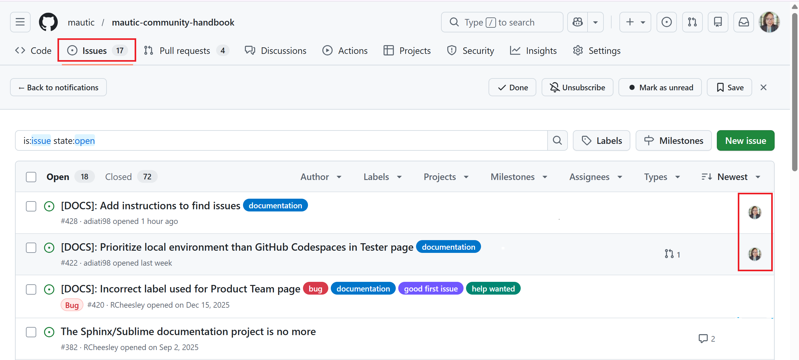
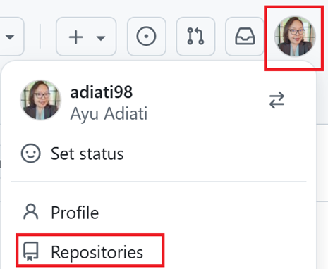

Mautic's documentation
######################

Mautic is always looking for help to improve the documentation and make it as useful as possible for the Mautic community.

There are three Mautic documentation repositories on GitHub open to contributions:

#. The :xref:`User Documentation` - :xref:`User Docs GitHub` 
#. The :xref:`Developer Docs` - :xref:`Developer Docs GitHub`
#. The :xref:`Community Handbook` - :xref:`Community Handbook GitHub`

.. note::

   Before you start, please read the contributing guidelines available in the ``.github/CONTRIBUTING.md`` file in each repository.

Finding and claiming an issue
*****************************

There are a couple of ways to find issues for you to work on:

#. At the GitHub repositories
#. At the Mautic low- and no-code GitHub projects board

GitHub repositories
===================

To find issues and claim one in a GitHub repository:

#. Go to the original repository on GitHub.
#. Click the **Issues** tab at the top. You should see the list of open issues.

#. Find an issue that interests you, and ensure it doesn't have an assignee.

   When an issue has an avatar at the end of the row, it indicates an assignee is working on it.

   |

   .. image:: images/issues_tab_github.png
      :alt: Highlight of Issues tab and assignees on GitHub.

   |

#. Once you find the issue that you want to work on, comment on it to express your interest and tag ``@mautic/education-team-leaders``.

Low- and no-code GitHub projects board
======================================

To find issues and claim one from the low- and no-code projects board:

#. Go to :xref:`Mautic low-no-code projects board` projects board.
#. Click the down arrow button at the **All Tasks** tab to view the options.
#. Select the **Slice by** option.
#. Select **Type of issue**.

   |

   .. image:: images/all_tasks_menu_github_projects.png
      :alt: Highlight of the all tasks dropdown menu, slice by, and type of issue options at GitHub projects board.

   |

#. Click the type of issue in the left bar, such as ``User Documentation``, ``Developer Documentation``, ``Community Handbook``, and so on, to see the list of issues in each type.
#. Scroll down the table and find the **Ready for contributors** group.

   |

   .. image:: images/type_of_issue_ready_for_contributors_list_github_projects.png
      :alt: The type of issue list and Ready for contributors group at Mautic's low-no-code GitHub projects board.

   |

#. Find an issue in the group that interests you and ensure it doesn't have an assignee. Scroll horizontally to find the **Assignees** column.

   |

   .. image:: images/assignees_column_github_projects.png
      :alt: Highlight of the assignees column at the GitHub projects board.

   |

#. Once you find the issue that you want to work on, click the issue title, comment on it to express your interest, and tag ``@mautic/education-team-leaders``.

.. attention::

   If you're interested in working on an issue, please always ensure:

   * The issue doesn't have an assignee.
   * Leave a comment on the issue and tag ``@mautic/education-team-leaders`` so that our team can assign you to the issue. If you don't comment on it, our team can't assign it to you.

Contributing workflow
*********************

In this section, you can find the contributing workflow and best practices for contributing to Mautic documentation.

Fork the repository
===================

Forking the repository is the first step you need to take before proceeding. Forking means making a copy of a repository to your GitHub account.

To fork a repository:

#. On the main page of the original repository, click the **Fork** button at the top.

   |

   .. image:: images/fork_button_github.png
      :alt: Fork button on GitHub.
      :width: 600px
      :align: center

   |

#. Select your username in the **Owner \*** dropdown menu.

   .. warning::
   
      **Don't select an organization here. Always choose your personal account.** Maintainers can't collaborate or fix issues in your PR if you don't select your personal account.

   |

   .. image:: images/choose_fork_owner_github.png
      :alt: Choose fork owner on GitHub.
      :width: 350px
      :align: center

   |

#. Deselect the **Copy the DEFAULT-BRANCH-NAME branch only** checkbox so you can clone multiple base branches.

#. Click the green **Create fork** button at the bottom.

   |

   .. image:: images/uncheck_option_and_create_fork_button_github.png
      :alt: A deselected checkbox to choose the option to copy only the default branch and a create fork button on GitHub.
      :width: 700px
      :align: center

Clone the repository
====================

After you forked the repository, you need to clone it. Cloning means copying a repository to your local environment. In this case, you want to clone your forked repository.

.. note::

   The Mautic User and Developer Documentation contains multiple branches that represent specific Mautic versions. You should clone each branch into its own dedicated folder and make your changes within the appropriate folder.

Follow the steps below to clone your forked repository:

.. vale off

#. Click your avatar on the top right.
#. Click **Repositories**.

   |

   .. image:: images/repositories_option_github.png
      :alt: Repositories option in GitHub's dropdown menu.
      :width: 300px
      :align: center

   |

#. Open your forked repository. The URL should have your username. For example: ``https://github.com/YOUR-GITHUB-USERNAME/REPOSITORY-NAME``.
#. Click the green **Code** button on top.
#. Select **HTTPS** and copy the URL.

   |

   .. image:: images/code_button_https_tab_github.png
      :alt: Highlight of code button, copy symbol, and HTTPS tab on GitHub.
      :width: 350px
      :align: center

   |

#. In your terminal, go to your local directory where you want to save the project.
#. Run the ``git clone`` command specifying the branch and folder name, and hit **Enter**:

   .. code-block:: bash

      git clone --branch BRANCH-NAME https://github.com/YOUR-GITHUB-USERNAME/REPOSITORY-NAME.git FOLDER-NAME

   Here are some examples:

   .. code-block:: bash

      # User documentation
      git clone --branch 7.1 https://github.com/YOUR-GITHUB-USERNAME/user-documentation.git user-docs-71
      git clone --branch 7.x https://github.com/YOUR-GITHUB-USERNAME/user-documentation.git user-docs-7
      git clone --branch 6.x https://github.com/YOUR-GITHUB-USERNAME/user-documentation.git user-docs-6
      git clone --branch 5.2 https://github.com/YOUR-GITHUB-USERNAME/user-documentation.git user-docs-5

      # Developer documentation
      git clone --branch 5.x https://github.com/YOUR-GITHUB-USERNAME/developer-documentation-new.git dev-docs-5

.. vale on

Create a new branch
===================

Before making changes, ensure that you create a new branch and work on it. You don't want to directly work on the default branch, such as ``main`` or any other base branch, because you won't be able to work on lots of things at the same time. If you make all those changes on one branch, you can't separate them and merge only one change at a time.

Ensure the correct base branch
------------------------------

Before you create a new branch, you must ensure that you're on the branch that you need to base your changes on. Here's how to do it:

#. In the bottom left of your VS Code, look at the branch tab that has a git branch symbol with a branch name. It should indicate the branch you need to base your changes on.

   |

   .. image:: images/bottom_branch_tab_vscode.png
      :alt: Branch tab at the bottom left of VS Code.
      :width: 400px
      :align: center

   |
   
#. If you're not on the correct branch, click the branch tab and select the correct branch from the dropdown menu at the top.

   If you prefer to switch it from the terminal, run the command below:

   .. code-block:: bash
   
      git switch BRANCH-NAME

Ways to create a new branch
---------------------------

There are two ways to create a new branch:

#. **With Git Source Control in VS Code**

   Working with :xref:`git source control` in VS Code is more comfortable if you're not technical and prefer a Graphical User Interface - GUI - over a terminal.

   To create a new branch with Git source control:

   #. Click the branch tab that has a git branch symbol with a branch name at the bottom left of your VS Code. It opens a dropdown menu at the top.

   #. Click the **Create new branch** option.

      |

      .. image:: images/create_a_new_branch_vscode.png
         :alt: Create a new branch option in a dropdown menu on VS Code.
         :width: 500px
         :align: center

      |

   #. Add a branch name with anything you like. Preferably, it reflects your changes. For example, ``fix-typo``.

   #. Press **Enter**.

#. **On terminal**

   If you prefer working with the terminal, run the following command:

   .. code-block:: bash
   
      git checkout -b YOUR-BRANCH-NAME

Now you can start making changes in this branch.

.. note::
      
   Once you create a new branch, it automatically switches to it. If you haven't seen the branch changes in your terminal, run ``git status``, and you should see your branch name.

Push changes to the remote repository
=====================================

If you have finished your changes, you can push them to the remote repository to create a pull request - PR. Push means moving your commits from your local to the remote repository.

There are two ways to push your changes to the remote repository:

#. **With Git Source Control in VS Code**

   .. vale off

   #. On the left panel, click the **Source Control** that resembles the git branches icon.

      |

      .. image:: images/git_source_control_vscode.png
         :alt: Source control icon on VS Code.
         :height: 300px
         :align: center

      |

   #. Click the **+** icon next to the file name to move it to the staging area. It means you're adding this file as 'ready' to commit.

   #. After you add all the files that you want to commit, add a commit message describing the changes you made. For example, ``fix: broken links``.

   #. Click the **Commit** button.

      |

      .. image:: images/stage_and_commit_source_control_vscode.png
         :alt: Highlight plus icon to add files to the staging area, commit message input, and commit button at Source Control in VS Code.
         :width: 300px
         :align: center

      |

   #. Click **Publish Branch** to open a dropdown menu.

      |

      .. image:: images/publish_branch_button_github.png
         :alt: Publish branch button on source control at VS Code.
         :width: 350px
         :align: center

      |

   #. Select ``origin: <YOUR-FORKED-REPOSITORY-URL>``.

      |

      .. image:: images/select_remote_repo_dropdown_menu_source_control_vscode.png
         :alt: Highlight origin remote repository in a dropdown menu on Source Control at VS Code.
         :width: 450px
         :align: center

      |

   .. vale on

#. **On terminal**

   #. Run ``git status``. It provides you with file paths of the files you've worked on. You can later copy these paths for the next step.
   #. Add the file paths that hold your changes to the staging area by running this command:

      .. code-block:: bash

         git add file-path-1 file-path-2

   #. Commit your changes with the following command:

      .. code-block:: bash

         git commit -m "your message"

      Change ``your message`` to briefly describe your changes. For example, ``fix: broken links``.

   #. Push your changes to the remote repository:

      .. code-block:: bash
      
         git push -u origin YOUR-BRANCH-NAME

Pull requests
=============

.. vale off

Before submitting a PR
----------------------

.. vale on

#. Ensure that you work on your changes in a new branch on your fork. Create one branch for each task you work on.
#. Make sure to run your changes locally and verify that everything is functioning as intended.

.. vale off

Creating a PR
-------------

.. vale on

.. vale off

#. Go to the original repository and click the green button to create a PR.

#. **This step is crucial.** Each branch contains documentation for a specific version of Mautic. **You must base your PR on the branch that corresponds to the version you're modifying**. If you don't, your changes may apply to the wrong version of the documentation. For instance, if you're making updates for the documentation version ``7.0``, you must base your PR on the ``7.0`` branch.

   At the top, you should see several dropdown menus: **base repository**, **base**, **head repository**, and **compare**.

   Click the **base: BRANCH-NAME**. It should open a dropdown menu. Select the base branch to the branch that your PR modifies.

   |

   .. image:: images/change_pr_base_branch_github.png
      :alt: Highlight of PR base branch on GitHub.
      :width: 800px
      :align: center

   |

#. Fill in the PR template.

   Make sure you give clear information about your changes in your PR:

   * **A title**. The PR title must describe the changes you made. For example: ``Add getting started page to API documentation``.
   * **A description**. A clear description can help PR reviewers understand the changes you made in your PR. It's always good to walk through the process of how a reviewer can test your changes.
   * **A related issue**. :xref:`link issue number` that you worked on and add a keyword of 'Closes', 'Fixes', or 'Resolves' in front of it. For example, ``Closes #123``, ``Fixes #234``, etc. You can find the issue number right next to the issue's title. When you link the issue number, the issue automatically closes once a maintainer merges your PR.
   * **Screenshots or screen recordings**. Provide screenshots or screen recordings for visual changes if necessary.

#. Submit it for review.

.. tip::

   Refer to :xref:`pr #369` in the Mautic Community Handbook for an example of a well-documented PR.

.. vale on

.. vale off

After submitting a PR
---------------------

.. vale on

#. Ensure that all checks pass. If the linting build or prose fails, debug and fix it until all passes. If you have questions or need help, feel free to tag the ``@mautic/education-team-leaders`` in the comment.

#. Keep your branch up to date while waiting for review.

#. Respond and address the reviewer's feedback. Please don't request a review until you've addressed all feedback.

.. note::

   When a maintainer asks you to rebase your PR because you based it on the wrong branch or selected the incorrect base branch while creating the PR, you can close your PR and create a new one using :ref:`Git cherry-pick`.

Git cherry-pick
---------------

In Git, cherry-picking means copying a commit and adding it to another branch.

To cherry-pick, please follow the steps outlined below:

#. Go to your forked repository on GitHub and click the **Sync fork** button. If you need to update your branch with the latest state of the original repository, you should see and click the green **Update branch** button.

   |

   .. image:: images/sync_fork_update_branch_buttons_github.png
      :alt: Sync fork and Update branch buttons on GitHub.
      :width: 800px
      :align: center

   |

#. In your code editor, make sure you are in the correct folder version of the cloned repository and that the base branch is up to date by running the following command:

   .. code-block:: bash
   
      git pull

#. Ensure you have the commits you need for cherry-picking by fetching all new remote files, commits, and branches you don't have locally. To do so, run:

   .. code-block:: bash
   
      git fetch origin

#. :ref:`Create a new branch`.

#. Navigate to your PR on GitHub and close it by clicking the **Close pull request** button located at the bottom.

   |

   .. image:: images/close_pr_button_github.png
      :alt: Close pull request button on GitHub.
      :width: 300px
      :align: center

   |

#. After closing the PR, click the **Commits** tab at the top. You should see the list of your commits.

#. Click the copy icon next to the hash to copy the full SHA - Secure Hash Algorithm - value.

   .. tip::

      If you have multiple commits, cherry-pick them and add them to the staging area one at a time. Start at the top and work through to the end.

   |

   .. image:: images/commits_tab_copy_full_sha_github.png
      :alt: Commits tab, list of commits, and copy icon button to copy the full SHA value on GitHub.
      :align: center

   |

#. In your terminal, run this command:

   .. code-block:: bash
   
      git cherry-pick COMMIT-HASH

   Change the ``COMMIT-HASH`` with the full SHA value that you've copied. Here's an example:

   .. code-block:: bash
   
      git cherry-pick a1b2c3d4e5f678901234567890abcdef12345678

#. If there are merge conflicts, resolve them before continuing. Once you've resolved them, you need to add the files to the staging area and continue the process:

   .. code-block:: bash
   
      git add .
      git cherry-pick --continue

   If you're using VS Code and a new tab opens to change the commit message, you can either enter a new one or close the tab to keep the original.

   You might get prompted with the following message:

   .. code-block:: bash
   
      On branch BRANCH-NAME
      You are currently cherry-picking commit XXXXXXX.
         (all conflicts fixed: run "git cherry-pick --continue")
         (use "git cherry-pick --skip" to skip this patch)
         (use "git cherry-pick --abort" to cancel the cherry-pick operation)

      nothing to commit, working tree clean
      The previous cherry-pick is now empty, possibly due to conflict resolution.
      If you wish to commit it anyway, use:

         git commit --allow-empty

      Otherwise, please use 'git cherry-pick --skip'

   If the files are in the state you want them to be, and you don't need a commit in your history, use the recommended skip option:

   .. code-block:: bash

      git cherry-pick --skip

   If you want to have a record in your history showing that you attempted to apply this specific commit, use the command Git suggests:

   .. code-block:: bash
   
      git commit --allow-empty

#. :ref:`Push your changes <Push changes to the remote repository>` to the remote repository.

#. :ref:`Create a new PR <Creating a PR>` and change the base branch to the correct version branch before clicking the **Create pull request** button.

Getting started
***************

Mautic built the documentation projects with :xref:`sphinx` and hosts it on :xref:`read the docs`.

The ``docs/`` directory contains the content, written in :xref:`RST`.

----

There are three ways to work on changes for the Mautic documentation:

1. Directly on GitHub
2. With a code editor, such as :xref:`VS Code` - **recommended**, on your local machine
3. With :xref:`GitHub Codespaces` on your browser

.. vale off

1. On GitHub
============

.. vale on

Making changes directly on GitHub is suitable for minor changes, such as fixing a typo. For bigger and more complex changes, please work locally or use GitHub Codespaces.

To work directly on GitHub, follow the steps below:

#. Click the **Edit on GitHub** button in the top-right corner of the page where you noticed the mistake. It takes you to the correct resource on GitHub.
   
   |

   .. image:: images/edit_on_github.png
      :alt: Mautic community handbook with a red box highlighting the Edit on GitHub button.
      :width: 500px
      :align: center

   |

#. Click the edit button that resembles a pencil, and make the necessary changes.

   |

   .. image:: images/edit_button_github.png
      :alt: Mautic community handbook with a red box highlighting the Edit on GitHub button.
      :width: 500px
      :align: center

   |

#. Follow the instructions to commit the changes.

#. Select to commit to a new branch. Call the branch something relative to what you're updating.

#. :ref:`Create a PR <Creating a PR>`.

.. vale off

2. Local development
====================

.. vale on

Prerequisite
------------

To work locally, you first need to install these on your machine:

.. vale off

#. **VS Code - recommended - or your preferred IDE**

   Download and install :xref:`VS Code` on your computer.

#. **DDEV**

   Mautic uses :xref:`DDEV` to simplify local development and testing of documentation updates. Go to the :xref:`DDEV get started` page for instructions to install DDEV on your local machine.

   .. note:: **For Windows users**:
      
      You can install and run :xref:`DDEV traditional windows`. However, using :xref:`WSL2` provides faster, better performance. If you're new to WSL, follow the instructions on the :xref:`DDEV WSL blog` to install and set up WSL and DDEV.

#. **Vale**

   Mautic uses :xref:`vale` to maintain style guide consistency across the docs. Go to the :xref:`install Vale` page on the official documentation to install Vale on your computer.

#. **GitHub CLI - optional**

   You can download and :xref:`install GitHub CLI` on your computer if you'd like. It could save you time to work on your GitHub workflow with GitHub CLI, particularly if you want to assist with code reviews.

.. vale on

.. tip::

   If you'd rather watch a video, you can find the :xref:`setting up local environment tutorial` tutorial on YouTube. Otherwise, you can follow the instructions provided in the next section.

Setting up the local environment
--------------------------------

#. :ref:`Fork the repository` to your own GitHub account.
#. Go to your forked repository on GitHub.
#. :ref:`Clone <Clone the repository>` your forked repository.
#. Navigate into the project directory by running:

   .. code-block:: bash
   
      cd REPOSITORY-NAME

   Replace ``REPOSITORY-NAME`` with the name of the project you provided. For example, ``user-docs-7``, ``dev-docs-5``, etc.

#. :ref:`Create a new branch` to work on your changes.
#. Start the DDEV environment with this command:

   .. code-block:: bash
   
      ddev start

#. Go to the ``docs/`` directory:

   .. code-block:: bash
   
      cd docs

#. Find the folder and file that you want to work on.
#. Make changes and ensure that the changes you made follow Mautic's style guide by running the Vale lint. Please read the :ref:`Working with Vale` section to use Vale. Use the live preview to ensure everything works as intended in real time.
#. Build the project by running:

   .. code-block:: bash
    
      ddev build-docs

#. Run the below command to view your changes live on your browser:

   .. code-block:: bash
    
      ddev launch

   DDEV uses the folder name as the project name. This command automatically opens your browser and navigates to ``https://FOLDER-NAME.ddev.site/``.

If you're ready to push your changes to the remote repository and create a PR, please read the :ref:`Push changes to the remote repository` and :ref:`Creating a PR` sections.

.. note::

   * Every time you make changes, run ``ddev build-docs`` and refresh the page in your browser to see the changes.
   * If you don't see the configuration take effect, run ``ddev restart`` to restart the project.

.. vale off

3. GitHub Codespaces
====================

.. vale on

To get the best experience, work locally whenever possible. However, if that’s not possible, you can quickly set up the project in the cloud using GitHub Codespaces. For a smooth process, use the Chrome or Firefox browser to work with Codespaces.

.. tip::

   To maximize your free Codespaces tier, you can set the default idle timeout. To do so:

   * Click your avatar on the top right
   * Click **Settings**
   * At the left bar, under **Code, planning, and automation**, click **Codespaces**
   * Find **Default idle timeout**
   * Set the idle time, and click **Save**

   You can also shut down your codespace whenever you've finished working by following these steps:

   * Close the VS Code on the browser
   * Go to :xref:`list of Codespaces`
   * Scroll down and you should see a list of your Codespaces at the bottom
   * Click the three dots icon at the codespace that you'd like to shut down
   * Click **Stop codespace**

   .. image:: images/stop_codespace_github.png
      :alt: Highlight three dots icon at a codespace and stop codespace option on GitHub Codespaces.
      :width: 800px
      :align: center

Setting up a codespace
----------------------

#. :ref:`Fork the repository` to your own GitHub account.
#. Go to your forked repository on GitHub.
#. Click the branch dropdown menu on the top left and select the branch you need to base your changes on. For example, if you need to update documentation for Mautic version 7, switch to ``7.x``.

   |

   .. image:: images/switch_branch_github.png
      :alt: Highlight branch dropdown menu on GitHub.
      :width: 300px
      :align: center

   |

#. Click the green **Code** button and select the **Codespaces** tab.

#. Click the green **Create codespace on BRANCH-NAME** or **+** button to create a new codespace. It automatically sets up the project and opens VS Code on the browser.

   |

   .. image:: images/codespaces_tab_github.png
      :alt: Highlight Codespaces tab, plus icon, and Create codespace on main at GitHub.
      :width: 300px
      :align: center

   |

#. Wait for the codespace to finish building. Once complete, the build prompt closes, and the README preview opens. You can close this preview after it appears. Next, the ``postCreateCommand`` runs. Please wait until it finishes its task.

   |

   .. image:: images/postcreatecommand_on_terminal.png
      :alt: The postCreateCommand running in the terminal.
      :align: center

   |

#. :ref:`Create a new branch` to work on your changes.

#. Go to the ``docs/`` directory:

   .. code-block:: bash
   
      cd docs

#. Find the folder and file that you need to work on.
#. Work on your changes and use the :ref:`live preview <Live preview on codespace>` to view and test your changes in real-time.
#. Ensure that the changes you made follow Mautic's style guide by running the Vale lint. Please read the :ref:`Working with Vale` section to use Vale.

Live preview on codespace
-------------------------

#. Ensure that you are in the ``docs/`` directory.
#. Run ``make html``. It generates the ``build`` folder.

   .. note::
      
      If you get ``make: *** No rule to make target 'html'.  Stop.`` error message after running the ``make html`` command, make sure you are in the correct directory. You must be in the ``docs/`` directory to execute this command successfully.

#. Click the preview button at the top that resembles a book and a magnifying glass to trigger Esbonio, a live preview tool. A tab opens, but the preview won't work. You can safely close this tab.

   |

   .. image:: images/preview_button_vscode_codespace.png
      :alt: Highlight the preview button on the top bar of VS Code on codespace.
      :width: 450px
      :align: center

   |

#. At the bottom panel, click the **Ports** tab.
#. Click the globe icon to open the live preview in your browser. Now you can see the project in real-time on localhost.

   |

   .. image:: images/port_and_open_browser_vscode_codespace.png
      :alt: Highlight the port tab and globe icon to open the preview in the browser at VS Code on codespace.
      :width: 450px
      :align: center

   |

If you're ready to push your changes to the remote repository and create a PR, please read the :ref:`Push changes to the remote repository` and :ref:`Creating a PR` sections.

.. tip::

   * Always refresh the page to view the new changes you have applied.
   * All commands only work within the ``docs/`` directory. If you're unable to run a command, verify that you're in the correct directory.
   * Read the :ref:`Troubleshooting live preview` section if you encounter any issues with the live preview in the codespace.

Troubleshooting live preview
~~~~~~~~~~~~~~~~~~~~~~~~~~~~

Troubleshooting #1
^^^^^^^^^^^^^^^^^^

If you can't see your changes in the live preview, run the ``make html`` command and refresh the browser tab.

Troubleshooting #2
^^^^^^^^^^^^^^^^^^

If refreshing doesn't work, try to:

#. Delete the ``build`` folder in the root
#. Delete the ``build`` folder in the ``docs/`` directory
#. Refresh your codespace browser
#. Ensure that you're in the ``docs/`` directory
#. Follow the steps in the :ref:`Live Preview on codespace` section

Troubleshooting #3
^^^^^^^^^^^^^^^^^^

If the previous steps fail:

#. Close VS Code and the live preview browsers
#. Go to :xref:`list of Codespaces`
#. At the bottom, you should see a list of your projects on Codespaces
#. Click the three dots icon on the right of your project's codespace
#. Click **Stop codespace**
#. Re-open the codespace by clicking its name
#. Follow the steps in the :ref:`Live Preview on codespace` section

Working with RST
****************

Indentations, spaces, and blank lines
=====================================

Indentation, spaces, and blank lines are essential when working with RST. Incorrect spacing causes the page formatting to break.

.. tip::

   If a broken format appears during live page preview, verify that the indentation, spacing, and blank lines are correct.

Headings
========

Nesting headings
----------------

When creating a heading or section title, underline the text with a punctuation character. The underline must be exactly as long as the text to prevent syntax errors and to ensure visual consistency across the documentation.

Mautic uses the following punctuation characters:

.. code-block:: rst

   Heading 1
   #########

   Heading 2
   *********

   Heading 3
   =========

   Heading 4
   ---------

   Heading 5
   ~~~~~~~~~

   Heading 6
   ^^^^^^^^^

.. note::

   Use only one H1 per page and nest the headings in the order shown. This keeps the documentation consistent and easy to read.

Titles
------

Mautic uses sentence case for titles. Capitalize only the first word, unless a word in the middle of the sentence is a Mautic feature or a proper name.

**Examples:**

.. code-block:: rst

   How to update Mautic
   ####################

   Updating at the command line
   ****************************

Inline markup
=============

Standard inline markup for RST includes the following:

* **Emphasis or italic**: use single asterisk - ``*italic*``
* **Strong or bold**: use double asterisks - ``**bold**``
* **Inline code**: use double backticks - ````inline code````

**Renders as:**

* *italic*
* **bold**
* ``inline code``

Lists
=====

Unordered list
--------------

Use the asterisk - ``*`` - for unordered lists.

.. note::

   * When an item has multiple paragraphs, add a blank line to separate them. Align the following paragraph with the beginning of the list item text.
   * If a :ref:`directive <Directives>` is part of an item, add a blank line before the directive. Align the directive with the beginning of the list item text.

**Example:**

.. code-block:: rst

   * First item.
   * Second item.

     Another paragraph of the second item.
   * Third item.
   * Take a look at the indentation of the image below. It aligns with this and the next bullet point.

     .. image:: images/issues_tab_github.png
        :alt: Highlight of Issues tab and assignees on GitHub.
   
   * Last item.

**Renders as:**

* First item.
* Second item.

  Another paragraph of the second item.
* Third item.
* Take a look at the indentation of the image below. It aligns with this and the next bullet point.

  .. image:: images/issues_tab_github.png
     :alt: Highlight of Issues tab and assignees on GitHub.

* Last item.

Nesting unordered lists
~~~~~~~~~~~~~~~~~~~~~~~

To nest an unordered list, separate the nested list from the parent list with blank lines and add **two spaces** of indentation relative to the parent list item.

**Example:**

.. code-block:: rst

   * First item.
   * Second item.

     * Part of the second item.
     * Another part of the second item.

   * Third item.
   * Fourth item.

**Renders as:**

* First item.
* Second item.

  * Part of the second item.
  * Another part of the second item.

* Third item.
* Fourth item.

Ordered list
------------

Use the sharp symbol followed by a period - ``#.`` - for ordered lists. This allows RST to handle the numbering automatically.

.. note::

   * When an item has multiple paragraphs, add a blank line to separate them. Align the following paragraph with the beginning of the list item text. 
   * If a :ref:`directive <Directives>` is part of an item, add a blank line before the directive. Align the directive with the beginning of the list item text.

**Example:**

.. code-block:: rst

   #. First item.
   #. Second item.

      Another paragraph of the second item.
   #. Third item.
   #. Take a look at the indentation of the image below. It aligns with the item. If the image's directive indentation is correct, the next item number is still in order.

      .. image:: images/issues_tab_github.png
         :alt: Highlight of Issues tab and assignees on GitHub.
   
   #. Last item.

**Renders as:**

#. First item.
#. Second item.

   Another paragraph of the second item.
#. Third item.
#. Take a look at the indentation of the image below. It aligns with the item. If the image's directive indentation is correct, the next item number is still in order.

   .. image:: images/issues_tab_github.png
      :alt: Highlight of Issues tab and assignees on GitHub.
   
#. Last item.

Nesting ordered lists
~~~~~~~~~~~~~~~~~~~~~

To nest ordered lists, separate the nested list from the parent list with blank lines and add **three spaces** of indentation relative to the parent list item.

**Example:**

.. code-block:: rst

   #. First item.
   #. Second item.

      #. Part of the second item.
      #. Another part of the second item.

   #. Third item.
   #. Fourth item.

**Renders as:**

#. First item.
#. Second item.

   #. Part of the second item.
   #. Another part of the second item.

#. Third item.
#. Fourth item.

Combining nested lists
----------------------

When combining unordered and ordered lists, follow the parent list spacing rules. If the parent is an unordered list, add **two spaces** of indentation to the nested list. If the parent is an ordered list, add **three spaces**.

**Examples:**

.. code-block:: rst

   An example of an **unordered list** as a parent:

   * First item of the parent list.

     #. This item has **two spaces** relative to the parent list item.
     #. Another item of the nested list.

   * Another item of the parent list.

   An example of an **ordered list** as a parent:

   #. First item of the parent list.

      * This item has **three spaces** relative to the parent list item.
      * Another item of the nested list.

   #. Another item of the parent list.

**Renders as:**

An example of an **unordered list** as a parent:

* First item of the parent list

  #. This item has **two spaces** relative to the parent list item.
  #. Another item of the nested list.

* Another item of the parent list.

An example of an **ordered list** as a parent:

#. First item of the parent list.

   * This item has **three spaces** relative to the parent list item.
   * Another item of the nested list.

#. Another item of the parent list.

Directives
==========

Directives are blocks of explicit markup that instruct the RST parser to render specific content types. 

Directive syntax 
----------------

Most directives follow this general format: 

.. code-block:: rst    

   .. DIRECTIVE_NAME:: ARGUMENTS 
      :OPTION: VALUE       

      CONTENT

**Structure:**

* **Directives** - Always start with two periods and a space, and end with two colons. 
* **Options** - These appear on the lines immediately following the directive name. They start and end with a single colon and require a three-space indentation. 
* **Content** - This follows a blank line and must align with the three-space indentation of the options.

Commonly used directives
------------------------

Mautic documentation frequently uses the directives listed below. You must follow the Mautic standards for these specific directives to maintain consistent formatting. 

While this list covers the most common cases, Sphinx provides many other directives that you can use. Refer to the :xref:`Sphinx directive documentation` for a complete list of available directives and detailed information.

Admonition
~~~~~~~~~~

Use admonitions to highlight specific information. Refer to the :ref:`Admonitions` section for details.

Image
~~~~~

Use the ``.. image::`` directive to insert visual assets. Refer to the :ref:`Image directive` section for more information.

Code-block
~~~~~~~~~~

Use the ``.. code-block::`` directive to display code snippets. Always specify the language - for example, ``bash``, ``php``, ``rst``, or other languages - to enable syntax highlighting.

**Example:**

.. code-block:: rst

   .. code-block:: php

      <?php

      namespace Mautic\Plugin\ExampleBundle;

      class MyClass
      {
          public function onPluginInstall()
          {
              // Logic for plugin installation
          }
      }

**Renders as:**

.. code-block:: php

   <?php

   namespace Mautic\Plugin\ExampleBundle;

   class MyClass
   {
       public function onPluginInstall()
       {
           // Logic for plugin installation
       }
   }

**Structure:**

* **Language** - Add the language name directly after the double colons. This ensures the code displays with the correct colors and formatting.
* **Indentation** - Indent the code snippet with **three spaces** to align it under the start of the directive name.

Table
~~~~~

Use the ``.. list-table::`` directive to organize data into rows and columns.

.. note::

   Mautic documentation uses the ``.. list-table::`` directive without a title. Only add text after the double colons if the context specifically requires one.

**Example:**

.. code-block:: rst

   .. list-table::
      :widths: 30 70
      :header-rows: 1

      * - Role title
        - Tasks
      * - Contributor
        - Submits code or documentation fixes.
      * - Maintainer
        - Reviews pull requests and manages releases.
      * - Triage Team
        - 

**Renders as:**

.. list-table::
   :widths: 30 70
   :header-rows: 1

   * - Role title
     - Tasks
   * - Contributor
     - Submits code or documentation fixes.
   * - Maintainer
     - Reviews PRs and manages releases.
   * - Triage Team
     -

**Structure:**

* **Widths** - Use the ``:widths:`` option to set the relative percentage for each column.
* **Header rows** - The ``:header-rows: 1`` option designates the first bulleted list as the table header. This formats the top row differently from the rest of the data.
* **Header structure** - The first bulleted list in the example defines the header row.
  
  .. code-block:: rst

     * - Role title
       - Tasks

* **List structure** - Each asterisk - ``*`` - represents a new row. Each dash - ``-`` - represents a column within that row. The first dash is column 1, the second dash is column 2, and so on.
* **Empty columns** - If a column has no content, include the dash - ``-`` - but leave the rest of the line blank. Every row must have the same number of dashes to maintain the table structure.

Admonitions
===========

Use admonitions to highlight information that requires extra attention. When writing an admonition, include a blank line between the directive and the content, and indent the content by **three spaces**.

RST supports these standard admonition types:

* ``attention``
* ``caution``
* ``danger``
* ``error``
* ``hint``
* ``important``
* ``note``
* ``tip``
* ``warning``

**Example:**

.. code-block::

   .. important::

      This is important information that you need to read.

**Renders as:**

.. important::

   This is important information that you need to read.

Customizing admonition title
----------------------------

To use a custom title, use the ``.. admonition::`` directive followed by the title.

Note that only one neutral color is available for this admonition type.

**Example:**

.. code-block:: rst

   .. admonition:: Customized admonition
    
      This is a customized admonition.

**Renders as:**

.. admonition:: Customized admonition
    
   This is a customized admonition.

Admonition contents
-------------------

Admonitions can contain lists, inline code, code blocks, and images. All content within the admonition must maintain the **three-space** indentation.

**Example:**

.. code-block::

   .. admonition:: Various contents

      This admonition contains various types of content:

      **List**

      * Item 1
      * Item 2

      **Inline code**

      ``inline code``

      **Code block**

      .. code-block:: bash

         $ git add .
         $ git commit -m "commit message"

      **Image**

      .. image:: images/issues_tab_github.png
         :alt: Highlight of Issues tab and assignees on GitHub.

**Renders as:**

.. admonition:: Various contents

   This admonition contains various types of content:

   **List**

   * Item 1
   * Item 2

   **Inline code**

   ``inline code``

   **Code block**

   .. code-block:: bash

      $ git add .
      $ git commit -m "commit message"

   **Image**

   .. image:: images/issues_tab_github.png
      :alt: Highlight of Issues tab and assignees on GitHub.

Working with internal links
***************************

Internal links connect related information within the same documentation project. By adding these links, readers can easily navigate between various pages and sections of the documentation.

Linking to a custom target
==========================

A target acts like a bookmark. Placing a target before a specific paragraph, image, code block, or other elements, allows a link to point directly to that spot.

.. note::

   Custom targets allow for linking between different files. Every target name should be unique, so the system can find the correct location regardless of which page the link is on.

**Example:**

.. code-block:: rst

   Code block below has a hidden label.

   .. _custom target:

   .. code-block:: php

      <?php

      namespace Mautic\Plugin\ExampleBundle;

      class MyClass
      {
          public function onPluginInstall()
          {
              // Logic for plugin installation
          }
      }

   Follow this :ref:`link to the code block <custom target>`.

**Renders as:**

Code block below has a hidden label.

.. _custom target:

.. code-block:: php

   <?php

   namespace Mautic\Plugin\ExampleBundle;

   class MyClass
   {
      public function onPluginInstall()
      {
         // Logic for plugin installation
      }
   }

Follow this :ref:`link to the code block <custom target>`.

**Structure:**

* **Target** - Start the line with two dots, a space, an underscore, the name, and a colon.
* **Placement** - Position the target on the line immediately before the element. Include one blank line between the target and the content.
* **Unique names** - Every target name must be unique across the entire documentation project.
* **The link** - Use the ``:ref:`` role to point to the target. Use the target name inside ``< >`` brackets for custom link text, such as ``:ref:`Custom text <custom target>```. Alternatively, use the target name alone inside backticks, such as ``:ref:`custom target```, to automatically navigate to the title of the section it marks.

Linking to a section heading within the current page
====================================================

Use this reference to navigate readers to related section headings on the same page.

.. note::

   This reference only works within the current file. To link to a heading on a different page, use a :ref:`custom target <Linking to a custom target>`.

**Examples:**

The examples below link to the actual "Linking to a section heading within the current page" heading on this page:

.. code-block:: rst

   * :ref:`Linking to a section heading within the current page`
   * :ref:`Click this link title <Linking to a section heading within the current page>`.

* **Standard link** - The first example uses the heading name and displays the text exactly as it appears on the page.
* **Custom link** - The second example uses specific text to override the heading name. Place your custom text before the ``< >`` brackets. The text inside the brackets must match the heading exactly.

**Renders as:**

* :ref:`Linking to a section heading within the current page`
* :ref:`Click this link title <Linking to a section heading within the current page>`.

Read more about the ``:ref:`` role in the :xref:`ref role documentation`.

Linking to another page in the same documentation repository
============================================================

Use the ``:doc:`` role to link to different pages within the same documentation repository.

.. code-block:: rst

   :doc:`contributing_docs`
   :doc:`/contributing/contributing_docs`
   :doc:`Custom title </contributing/contributing_docs>`

In these examples, the link points to a file named ``contributing_docs.rst``.

* **Relative path** - The first example links to a page in the same folder as the current file.
* **Absolute path** - The second example uses a forward slash ``/`` to start from the top-level folder of the documentation. Include the full path and all folder names, such as ``/contributing/``.

  This path approach is **preferable** because it avoids broken links and eliminates the need to update the path when restructuring content.
* **Custom title** - The third example overrides the page title with custom title.

.. note::
    
   Don't include the ``.rst`` file extension when linking to another page. Sphinx adds this automatically during the build process.

Learn more about ``:doc:`` in the :xref:`doc role documentation`.

Working with external links
***************************

This section provides the guidelines and commands for managing external links. You must execute all DDEV commands from the ``docs/`` directory.

Reusing external links
======================

Mautic stores external links in the ``/links`` directory to keep them organized. Before you add a new external link, verify that it's not already in the directory.

This approach is preferable because it prevents duplicate entries and simplifies link management. If the link exists, use the established reference. If the link is missing, you must :ref:`add it to the directory <Add a new external link>` before using it in a page.

To make sure the link is available, in VS Code:

#. Click the search button that resembles a magnifying glass in the left bar or press ``Cmd/Ctrl + Shift + F``.

   |

   .. image:: images/search_icon_vscode.png
      :alt: Highlight search icon button in the left bar of VS Code.
      :height: 300px
      :align: center

   |

#. Paste the URL in the search bar.
#. If it's available, you should see the file that contains it.
#. Open the file and copy the ``link_name`` value. For example:

   .. code-block:: python

      from . import link

      link_name = "Developer Docs" # Copy this link_name
      link_text = "Developer Documentation"
      link_url = "https://devdocs.mautic.org" 

      link.xref_links.update({link_name: (link_text, link_url)})

#. Apply it in the content using ``:xref:``.

   .. code-block:: rst

      :xref:`Developer Docs`

Add a new external link
=======================

Depending on where you work on your changes, when you need to add an external link, run the command below in the terminal.

If you work locally with DDEV:

.. code-block:: bash

   ddev exec make link

If you work with Codespaces:

.. code-block:: bash

   make link

Then input the answer to all prompts:

.. vale off

* **Enter a Unique Link Name:** the name of the link.
* **Enter the link text the user sees:** the link text that appears on the website.
* **Enter the URL:** the link URL.
* **Enter the .py file name (use_lower_case_and_underscore of link name):** the name of the file.

.. vale on

Sphinx creates the file in the ``/links`` directory once you've completed the prompts. Copy the resulting ``xref`` macro from your terminal to apply the link in the content.

.. note::

   Ensure that all entries are clear and general so that anyone working on this project can easily search for and reuse them.

Here's an example:

.. code-block:: bash

   Enter a Unique Link Name: Developer Docs
   Enter the link text the user sees: Developer Documentation
   Enter the URL: https://devdocs.mautic.org/
   Enter the .py file name (use_lower_case_and_underscore of link name): mautic_developer_docs

Here's what you should see after completing the prompts:

.. code-block:: bash

   The link name is:  Developer Docs
   The link text is:  Developer Documentation
   The URL is:  https://devdocs.mautic.org/
   Creating the file:  links/mautic_developer_docs.py
   Enter the link in content as :xref:`Developer Docs`
   The user will see: Developer Documentation
   Make sure you build and test the link.

Identify broken links
=====================

To avoid build failures, make sure there are no broken links. You can verify the links by following the instructions below, based on where you're making changes in the terminal.

If you work locally with DDEV:

.. code-block:: bash

   ddev exec make checklinks

If you work with Codespaces:

.. code-block:: bash

   make checklinks

You should see a list of links. To identify broken links, follow these steps:

.. vale off

#. In your terminal, press ``Cmd/Ctrl + F``.
#. Type 'broken'. You should see the count of the word next to the search bar.
#. Click the down arrow to locate the broken links.

Here's an example of a broken link:

   .. image:: images/broken_link_example.png
      :alt: Example of a broken link with error message: (contributing/contributing_docs_rst: line  198) broken    https://sublime-and-sphinx-guide.readthedocs.io/en/latest/references.html#add-link-make-command - 404 Client Error: Not Found for url: https://sublime-and-sphinx-guide.readthedocs.io/en/latest/references.html.
      :width: 600px
      :align: center

.. vale on

Fix broken links
================

After identifying the broken links, the next step is to fix them.

.. vale off

Status code 404
---------------

.. vale on

If the broken links have a status code of ``404 Client Error: Not Found for url``, follow the steps below to fix them:

#. Copy the broken link URL from the terminal.
#. Follow the steps in the :ref:`Reusing external links` section to find the link file and to copy the ``link_name`` value.
#. Search ``:xref: `VALUE```.
#. You should see files that contain the search item.
#. Open the file and review the content to understand the context.
#. Find alternative resources to replace the broken link based on that context.

Other status codes
------------------

For broken links with a status code other than 404, such as ``403 Client Error: Forbidden for url``, broken anchor, timeout, etc. - **as long as the URL works**:

#. Open the ``conf.py`` file in the ``docs/`` directory.
#. List the URL in the ``linkcheck_ignore`` array and give a comment of the error:

   .. code-block::

      # 403 error from this domain
      r"URL",

   Change the ``URL`` to the broken link URL. For example:

   .. code-block::

      # 403 error from this domain
      r"https://www.npmjs.com/",

.. tip::

   If you're unsure about fixing broken links, report the broken link and tag ``@mautic/education-team-leaders`` in the PR comments for assistance.

.. vale off

Working with Vale
*****************

.. vale on

Your changes must follow Mautic's style guide. To ensure that the changes are consistent with the style guide, in your terminal:

#. Ensure that you're in the ``docs/`` directory.

   If you're not, and assuming you're in the project's root, run this command:

   .. code-block:: bash
   
      cd docs

#. Run Vale:

   .. code-block:: bash
   
      vale FOLDER-NAME/FILE_NAME.rst

#. Look at the errors, warnings, and suggestions.
#. Address all of them and rerun Vale to ensure they pass the checks.
#. If you're sure that the style is good but Vale still gives suggestions, you can wrap the sentence in ``.. vale off`` and ``.. vale on`` statements. Here's an example:

   .. code-block:: rst
   
      .. vale off

      Regarding assets like JavaScript and CSS, the source files are loaded instead of concatenated, minified files. This way, the changes in those files will be directly visible when refreshed. If you want to see the change in the production environment, run this command:

      .. vale on

   If the suggestion targets a specific point in a list, you first need to ensure that the entire list adheres to the style guide. Then, wrap the whole list in the ``.. vale off`` and ``.. vale on`` statements as example below:

   .. code-block:: rst
   
      .. vale off

      * All PRs are made against the ``c.x`` branch in the first instance, for instance, ``5.x``.
      * If the PR should be merged in an earlier release than the next major release of Mautic, duplicate the PR against the relevant ``a.b`` branch for bug fixes - for example, ``5.0`` - or ``a.x`` branch for features and enhancements - for example, ``5.x``.
      * Backwards compatibility breaking changes can only be released in a major version, so they should only ever be made against the ``c.x`` branch, such as, ``5.x``.

      .. vale on

.. attention::

   * Wrap the sentences you want Vale to skip with both ``.. vale off`` and ``.. vale on`` statements in that order. If you fail to do this, Vale skips the remaining contents.
   * Don't add statements to skip lint, unless necessary. If you're uncertain, it's best not to wrap them in the statements and let the team review and provide suggestions.

.. vale off

Working with code samples
*************************

.. vale on

Code samples get downloaded from GitHub to ensure that they're always up to date. If you need to add a new code sample, follow these steps:

.. vale off

#. In your terminal, run the command below depending on your working environment:

   If you work locally with DDEV:

   .. code-block:: bash
   
      ddev exec make code-sample

   If you work with Codespaces:

   .. code-block:: bash
   
      make code-sample

#. Input the answer to all prompts:

   * **Enter a Unique File Name (with .php suffix):** the unique name of the file that links to the code sample on GitHub with ``.php`` suffix.
   * **Enter the URL to the file (should start with https://raw.githubusercontent.com/...):** the link to the file that consists of a code sample on GitHub.
   * **Enter the .py file name (use_lower_case_and_underscore of link name):** the name of the code sample file.

   .. attention::
      
      URLs to the code sample should always start with ``https://raw.githubusercontent.com/...`` to ensure that Sphinx can download the file correctly. You also need to remove ``/blob`` from the original URL.

   For instance, the code example that you want to provide is available in the ``plugin-helloworld`` repository with this URL:
   
   .. code-block:: text
   
      https://github.com/mautic/plugin-helloworld/blob/mautic-4/Entity/World.php
   
   Then, the code sample URL should be:
   
   .. code-block:: text
   
      https://raw.githubusercontent.com/mautic/plugin-helloworld/mautic-4/Entity/World.php

   Here's a complete example of how to fill out prompts:

   .. code-block:: bash
   
      Enter a Unique File Name (with .php suffix):  entity_world.php
      Enter the URL to the file (should start with https://raw.githubusercontent.com/...):  https://raw.githubusercontent.com/mautic/plugin-helloworld/mautic-4/Entity/World.php
      Enter the .py file name (use_lower_case_and_underscore of link name):  helloworld_entity_world

   Here’s what you should see after completing the prompts:

   .. code-block:: bash

      The file name is:  entity_world.php
      The URL is:  https://raw.githubusercontent.com/mautic/plugin-helloworld/mautic-4/Entity/World.php
      The .py file name is:  helloworld_entity_world
      Creating the file:  code_samples/helloworld_entity_world.py
      Enter the link in content as .. literalinclude:: ../code_samples_downloaded/entity_world.php
      Make sure you build and test the code sample.

#. In the documentation RST file where you need to add the code sample, add ``.. literalinclude::`` directive followed by the unique file URL to render the code:

   .. code-block:: python
   
      .. literalinclude:: ../code_samples_downloaded/UNIQUE_FILE_NAME.php
         :language: LANGUAGE

   Here's an example:

   .. code-block:: python
   
      .. literalinclude:: ../code_samples_downloaded/entity_world.php
         :language: php

#. Download the code sample by building the docs with the command below, depending on your environment.

   .. _build-docs commands:

   If you work locally with DDEV:

   .. code-block:: bash

      ddev build-docs

   If you work with Codespaces:

   .. code-block:: bash

      make html

.. vale on

.. note::

   If you change the URL to a file, delete the cached file from ``docs/code_samples/__pycache__`` and run the :ref:`command to build the docs <build-docs commands>`. Sphinx automatically re-downloads it.

Updating Mautic UI images
*************************

To update the User Interface - UI - images for Mautic, fork and clone the :xref:`Mautic GitHub repository`.

Follow the instructions on the :doc:`tester` page for guidance on installing and running Mautic.

Working with images
===================

Images directory
----------------

Mautic organizes documentation by using a specific structure for all visual assets. This method places images close to the content they illustrate, making it easier to maintain.

Place all image files within the ``images`` subdirectory located inside the relevant section folder:

* Identify the specific directory containing the documentation page
* Open the ``images`` subdirectory within that directory and add the new image
* Create the ``images`` folder if it doesn't already exist

**Directory structure**

.. code-block:: text

   .
   └── docs/
      └── contributing/
         ├── images/
         │   ├── broken_link_example.png
         │   └── change_branch.png
         └── contributing_docs.rst

Image convention
----------------

File format
~~~~~~~~~~~

Mautic uses the ``.png`` format for images. For dynamic visuals, Mautic accepts the ``GIF`` format.

Name convention
~~~~~~~~~~~~~~~

To maintain consistency with RST formatting, use underscores - ``_`` - to separate words when naming an image file.

**Example:**

``broken_link_example.png``

Highlighting parts in an image
------------------------------

Use the color **red** to draw boxes that highlight specific parts of an image.

**Example:**



Image directive
---------------

An image directive includes options such as alt text, image width, and alignment.

**Example:**

.. code-block:: rst

   .. image:: images/repositories_option_github.png
      :alt: Repositories option in GitHub's dropdown menu.
      :width: 300px
      :align: center

**Renders as:**



|

**Structure:**

* **Indentation** - Indent every option by exactly **three spaces** to align the colon with the first letter of the directive name.
* **Spacing** - Avoid blank lines between the directive and its options.
* **Alt text** - Always include the ``:alt:`` option to provide a text description for screen readers and search engines.
* **Width** - Use the ``:width:`` option to set the image size in pixels - ``px`` - or percentage - ``%``.
* **Alignment** - Use the ``:align:`` option to place the image at the ``left``, ``center``, or ``right``. If you omit this option, the image defaults to the left.

.. attention::

   Any blank line between the directive and its options, or between the options themselves, causes the image to fail to render. Incorrect indentation displays a broken image icon, followed by the options - such as alt text - appearing as plain text.

Alt text best practices
-----------------------

Effective alt text ensures the documentation remains accessible. Follow these standards for every image:

* **Capitalize the first word** - Start every alt text string with a capital letter.
* **Include a period** - End the alt text with a period to ensure screen readers pause correctly.
* **Describe the function** - Focus on the information the image shows, such as "The Campaign Trigger menu showing the Email sent option."
* **Maintain conciseness** - Avoid phrases like "Image of" or "Screenshot of," as screen readers already identify the element type.
* **Include visible text** - If the image displays a specific error message or button label, include that text in the alt option.

**Example comparison:**

* **Poor:** ``:alt: screenshot of Mautic dashboard``
* **Better:** ``:alt: The Mautic dashboard showing the Contact growth widget.``