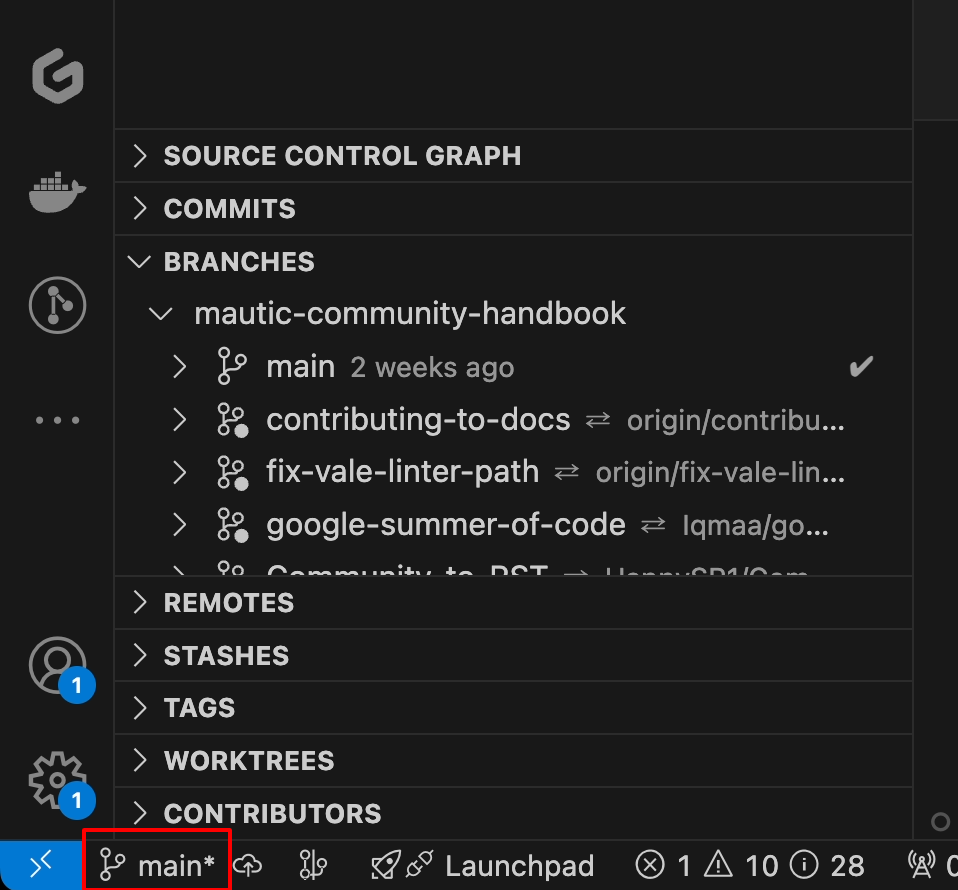

Contributing to Mautic's documentation
######################################

So you're interested in contributing to Mautic's documentation? That's fantastic. Mautic is always looking for help to improve the documentation and make it as useful as possible for the Mautic community. There are three main repositories on GitHub open to contributions. These are:

1. The :xref:`User Documentation` - :xref:`User Docs GitHub` 
2. The :xref:`Developer Docs` - :xref:`Developer Docs GitHub`
3. The :xref:`Community Handbook` - :xref:`Community Handbook GitHub`

Getting started
***************

You can work with the documentation locally, using DDEV and an editor like VSCode. This allows you to make changes and see them in real-time on a locally hosted version of the documentation. It's recommended as you can benefit from having syntax highlighting, and also generate the docs to verify the layout of your work as you go.

You can also use the web-based tool :xref:`Gitpod`, which allows you to spin up a temporary cloud-hosted instance of the documentation, make changes, and submit a pull request to have your changes merged back into the main repository. You can also test PRs with Gitpod, too.

Working locally
===============

To get started with one of the documentation repositories locally, it's advised to install:

- Git - :xref:`install Git`
- Docker Desktop - All operating systems, :xref:`install Docker Desktop` - or Colima - Mac and Linux, :xref:`install Colima`
- DDEV - :xref:`install DDEV`
- VSCode - :xref:`install VSCode`
- GitHub CLI - :xref:`install GitHub CLI`
- Vale linter - :xref:`install Vale`

Once you have these installed, you can clone the repository you want to work on.

To do this follow these steps:

1. Open the GitHub repository that you want to work on
2. Click the "Fork" button in the top right corner of the repository
3. Create a directory on your local computer which you can use for working on this project. For example, ``~/Documents/Sites/local.user-documentation``
4. Clone your fork of the repository to your local machine by running the following command in your terminal - this assumes you have GitHub CLI installed:

.. code-block:: bash

    gh repo clone <your-username>/<repository-name>

4. Change into the docs subdirectory of the repository you just cloned using the ``cd`` command - for example ``cd ~/Documents/Sites/local.user-documentation/docs`` - this is the working directory where all the files are located.
5. Type ``ddev config`` and press enter. This creates a ``.ddev`` directory in your project with the necessary configuration files. Accept all the settings as they're - you don't need to make any changes unless you know what you're doing.
6. Type ``ddev start`` and press enter. This starts the Docker containers and create a local development environment for you to work in. Open the URL that it creates in the browser - ``ctrl`` + ``click`` on the URL in the terminal to open it.
7. Type ``make html`` to build the HTML for the documentation. This creates a ``_build`` directory in your project with the compiled HTML files which you can now access at the URL that DDEV informed you of in step 6.
8. Refresh the web browser, and verify that the documentation is showing as expected.

Hurrah, now you're ready to get started with contributing to the documentation. 🥳

Making your first pull request
==============================

When you want to make a change in the documentation, you need to submit a Pull Request - PR - to the relevant repository. This is a request to the maintainers of the repository to merge your changes into the main branch of the repository. While it sounds a bit confusing, once you've done it a few times it becomes second nature.

Here's how to get started:

1. Set up your local environment as described in :ref:`Working locally`

2. By default we start on the default branch for the repository, but be sure to verify this is the case. In VSCode it'll show this in the bottom left hand toolbar. If you're not on the default branch, you can switch to it by running the following command in your terminal: ``git checkout 5.x`` - replace ``5.x`` with the name of the default branch if it's different. At the command line, use the command ``git status`` to see which branch you're on and ``git checkout 5.x`` to change to the default branch - replacing ``5.x`` with the name of the default branch if it's different.

3. Create a branch in your local repository to work on your changes by running the following command in your terminal: ``git checkout -b <branch-name>`` - for example, ``git checkout -b fix-typo-in-introduction``. In VSCode you can also create a new branch by clicking on the branch name in the bottom left corner of the window and selecting 'Create new branch' and providing a relevant name. Keep branch names relevant to what you're working on, as this helps you to keep track of what you're doing and clean up old branches once they aren't needed any more.

4. Make your changes in the documentation. You can do this in your editor of choice, and see the changes in real-time in your browser by typing ``make html`` in the terminal and refreshing the browser.

5. Fix any issues that the Vale linter flags up while you are working - you'll see these as red, yellow or blue squiggly lines in your editor with the color denoting them being an error, warning or notice respectively.
   

6. Be sure to regularly build the HTML files by typing ``make html`` in the terminal, and refresh the browser to verify that your changes are showing as expected. When you build the files, it highlights any syntax errors such as incorrect heading nesting or broken links for you to fix.

7. Commit your changes to your local repository by running the following command in your terminal: ``git add <filename>`` to stage specific files, and then ``git commit -m "A brief description of the changes you made"`` - for example, ``git commit -m "Fix typo in introduction"``. You can also do this in the VSCode editor by clicking on the source control icon in the left-hand toolbar, staging the files you want to commit by clicking the plus icon which appears on hover, and then adding a commit message in the box above.

8. Push your changes to your fork of the repository by running the following command in your terminal: ``git push origin <branch-name>`` - for example, ``git push origin fix-typo-in-introduction``. This sends your changes to your fork on GitHub. To do this in the VSCode editor, first publish the branch by clicking on the blue button in the version control panel, and then push the changes by clicking on the three dots next to the branch name and selecting 'Push' or clicking the blue button marked 'synchronize changes'.  Continue to make and stage changes and synchronize in this way until you've completed your work.

9. Go back to the original repository - not your fork, but the upstream version - and create a new pull request by clicking on the green button which shows at the top of the page. This takes you to a page where you can review the changes you've made, and add a description of what you've done. Once you're happy with the changes, click the 'Create pull request' button to submit your changes for review.

10. Don't forget to add a clear description of what you've done in the pull request, and if you're fixing an issue, be sure to reference it in the description. This helps the maintainers to understand what you're doing and why.

11. Wait for the maintainers to review your PR and when they do, be sure to respond to any comments they make. This might involve making further changes to your PR, or answering questions they have about your work. Once they're happy with your changes, they'll merge them into the main branch of the repository and your work is automatically deployed on the documentation site. Great job, you're now the latest contributor to Mautic. 🥳

