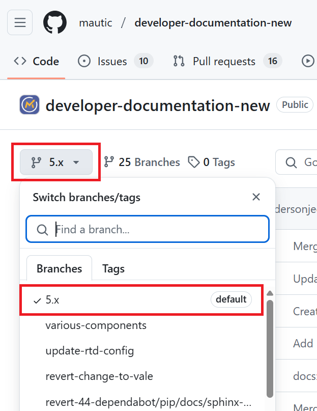

Developer documentation
#######################

Contributing to the developer documentation
*******************************************

.. vale off

Thank you for being so interested in helping improve Mautic's :xref:`Developer Docs`. Mautic's documentation is hosted on the `Read the Docs platform <https://about.readthedocs.com/?ref=readthedocs.org>`_ and generated using `reStructuredText (RST) <https://www.sphinx-doc.org/en/master/usage/restructuredtext/basics.html>`_.

.. warning::

    The Developer documentation is currently being updated and re-platformed. If you'd like to help with this, please check the issues in the :xref:`Developer Docs GitHub`.

.. vale on

Table of contents
*****************

* :ref:`Before your first contribution`
* :ref:`Your first documentation contribution`
* :ref:`Your next Documentation contributions`
* :ref:`Build the documentation locally`

Before your first contribution
==============================

Before contributing, you need to:

* Sign up for a free `GitHub account <https://github.com/signup>`_.
* Get familiar with the `reStructuredText <https://www.sphinx-doc.org/en/master/usage/restructuredtext/basics.html>`_ markup language.

Your first documentation contribution
=====================================

In this section, you'll learn how to contribute to the Mautic's Developer Documentation for the first time.

Forking and cloning a repository
--------------------------------

Before contributing, you must go to the `Developer Documentation repository <https://github.com/mautic/developer-documentation-new?tab=readme-ov-file>`_ on GitHub, fork, and clone it. Follow these steps to fork and clone the repository:

#. Click the "Fork" button on the top right.

   .. image:: ../images/fork_button_github.png
     :width: 600
     :alt: Fork button on GitHub

   .. vale off

   "Fork" means copying the original repository (Mautic's Developer Documentation) to your GitHub account. The original repository is usually known as ``upstream``, while your forked repository is called the ``origin`` repository.

   .. vale on

#. Click the green "Code" button and copy the URL of your forked repository.

   .. image:: ../images/copy_url_github.png
     :width: 600
     :align: center
     :alt: Green code button and repository URL on GitHub

#. Clone the forked repository to your local machine.

   .. code-block:: bash

     git clone https://github.com/YOUR-GITHUB-USERNAME/developer-documentation-new.git

   "Clone" means creating a copy of a repository for your local machine.

Creating a new branch and working on changes
--------------------------------------------

You always want to create a new branch from the default branch of a repository. To know the default branch of a repository, click the dropdown menu at the top left. Then click the branch that has a "default" label to set it.

Now follow the steps below to create a new branch and work on your changes:

#. Create a new branch to work on your changes from the default branch.

   Use a short and descriptive name for the new branch. For example, if you are working on an issue, use ``fix_XXX`` as the branch name, where "XXX" is the number of the issue.

   .. code-block:: bash

     git checkout -b BRANCH_NAME

   For example:

   .. code-block:: bash

     git checkout -b fix_1234
   
   In this example, the ``checkout -b`` command tells Git to create a new branch called ``fix_1234`` and automatically switch to this branch. However, you want to ensure you're in the right branch by running ``git status``.

#. Open the file you want to work on, make the changes, and do your best to comply with the documentation standards. Then, add, commit, and push your changes to the remote repository.

   .. code-block:: bash

     git add FILE_PATH
     git commit -m "your commit message"
     git push -u origin BRANCH_NAME

   For example:

   .. code-block:: bash

     git add docs/rest_api/categories.rst
     git commit -m "add a detail in categories.rst"
     git push -u origin fix_1234

   These commands tell Git to:
   
   * add the changes in the file onto the staging area,
   * save the changes in the file by committing the changes and record the changes with the commit message,
   * bring all changes in the ``fix_1234`` branch to your forked repository by pushing it from your local machine to the ``origin`` remote repository.

You're now ready to initiate a pull request (PR).

Creating a pull request
-----------------------

#. Go to your forked repository at ``https://github.com/YOUR-GITHUB-USERNAME/developer-documentation-new``.
#. Click the green "Compare & pull request" button in the orange banner at the top.

   .. image:: ../images/compare_pull_request_button.png
     :width: 600
     :align: center
     :alt: Compare & pull request button on GitHub

#. Provide a title and a description for your PR. A brief phrase or paragraph detailing the proposed changes is enough to facilitate the review of your contribution.
#. Click the green "Create pull request" button at the bottom.

.. vale off

You've successfully submitted your first contribution to the Mautic's Developer Documentation. Congratulations!

The documentation managers will carefully review your work. They will either approve and merge your PR or let you know if you need to make changes.

.. vale on

You don't need to create a new PR if the reviewer asks you to add or modify something. You can make the changes on the same branch that you pushed. Here is how you do it:

* Run ``git status`` to ensure you are on the correct branch.
* Make your changes.
* Add, commit, and push your changes.

Your next documentation contributions
=====================================

Since you already have a copy of the Mautic's Developer Documentation repository in your GitHub account and on your local machine, you don't need to fork and clone the repository for your next contribution.

To make another contribution, follow the steps from the section on :ref:`Creating a new branch and working on changes` until you reach the :ref:`Creating a pull request` section.

Build the documentation locally
===============================

.. vale off

.. note::

    The instructions for building the documentation locally will be added at a later stage.

.. vale on
