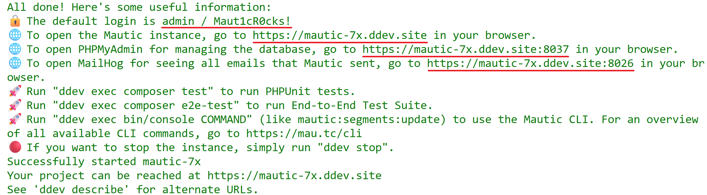
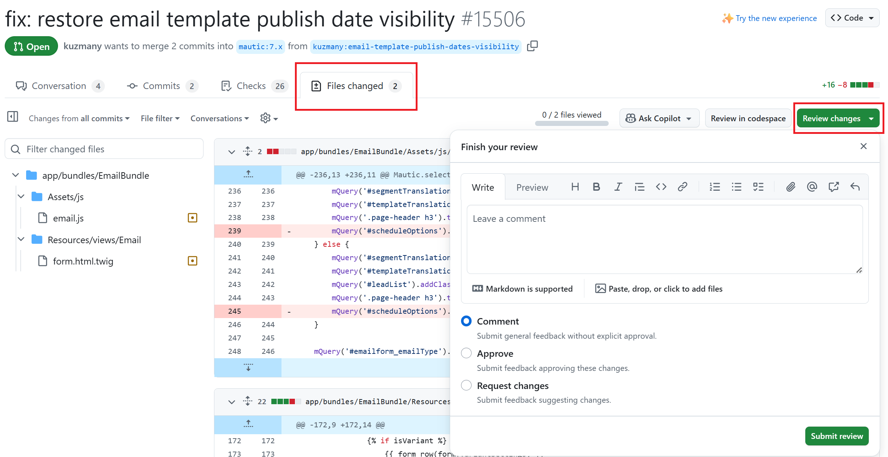

Tester
######

.. vale off

Every new feature and bug fix that is released in Mautic has undergone testing and code review by members of the community before it makes it into a release.

We are always looking out for people to help us with these processes. Even if you can spare an hour or two a week, it would significantly increase the number of bugs and features that make it out into the hands of Mautic users.

There are two ways to set up your testing environment:

1. On GitHub Codespaces
2. On your local machine with DDEV — **recommended**

Once your testing environment is established, it is very quick and easy to test bugs and features.

.. tip::

  You can watch the short tutorial about :xref:`How to test bugs and features in Mautic` on YouTube, which explains the easy way to do it.

Mautic maintains :xref:`Mautic OSS Fridays board` which shows you a list of all of the bugs and features that we want to get tested.

Setting up a testing environment on GitHub Codespaces
*****************************************************

:xref:`GitHub Codespaces` allows you to spin up a Mautic instance in the cloud, with a pull request — also known as PR — applied. The Mautic instance also has a mail catching tool, MailHog, and PHPMyAdmin available to view database tables. While some PRs can't be tested in this way, such as when you need to test the installation process, the vast majority can.

Setting up a codespace
======================

#. Go to :xref:`Mautic GitHub repository`.
#. Open the PR that you need to test.
#. Click the 'Code' button on the right top, next to PR's title.
#. Click the 'Codespaces' tab.
#. Click the green 'Create codespace on BRANCH-NAME' or '+' sign to create a codespace.

   .. image:: images/open_codespace_github.png
    :alt: Screenshot highlighting code button and codespaces tab

#. Wait until the codespace finishes building and the ``postCreateCommand`` finishes its task. Please be patient, as it may take some time.

   **Note:** If you get a warning that the codespace is currently running in recovery mode due to a configuration error, as in the following screenshot, follow the instructions in the :ref:`Rebuild a codespace` section.

   .. image:: images/codespace_recovery_mode_warning.png
    :alt: Warning message that says this codespace is currently running in recovery mode due to a container error.
    :scale: 80 %
    :align: center

#. Run ``ddev start`` to install Mautic and its dependencies.
#. Type 'Y' and press Enter when you get prompted to ``Permission to beam up? [Y/n] (yes):``.

   Please wait until the process is complete, which may take a few minutes.

#. Click 'Ports' tab.
#. Find the port that you need to open.
#. Hover over the 'Forwarded Address' tab, right next to the port.
#. Click the globe icon to open the port in the browser.

   .. image:: images/vscode_terminal_ports_tab.png
    :alt: Screenshot of ports tab in VS Code terminal, highlighting globe icon 

#. Log in to Mautic. See the tip below to log in to Mautic.

After you set up the environment, you can follow the test instructions in the PR and :ref:`report back your findings<Leaving your review>`. 

.. tip::

   * The default username to login to Mautic is always ``admin``, and the password is ``Maut1cR0cks!``.
   * If you're testing an older version of Mautic than ``5.1``, use the password ``mautic``.
   * You can run the ``ddev describe`` command to see the list and details of available URLs and ports.

Rebuild a codespace
-------------------

Follow these steps to rebuild your codespace:

#. Press ``Cmd/Ctrl + Shift + P``. It opens a search bar on top.
#. Search for 'Codespaces: Rebuild Container', select it, and click it.

   .. image:: images/codespaces_rebuild_container.png
    :alt: Screenshot of codespaces rebuild container selection

#. Click the 'Full Rebuild' button.

   .. image:: images/codespaces_rebuild_button.png
    :alt: Screenshot highlighting the full rebuild button on Codespaces
    :align: center
    :scale: 70 %

.. note::

   Now that you've set up the codespace, go to the :ref:`Testing your first PR` section to start testing a PR. 

Setting up a local testing environment
**************************************

Prerequisites
=============

Before starting, you will need a few pieces of software on your computer:

* :xref:`Docker Desktop`
* :xref:`DDEV get started`
* :xref:`Git downloads`
* :xref:`GitHub CLI`

Once you have these installed, we recommend that you use a code editor such as :xref:`VS Code`, which allows you to interact with files, folders, and the command line. There are other editors and Integrated Development Environments (IDEs). So if you already have a preference, by all means, use that.

You also need to register for an account at :xref:`GitHub signup` if you don't already have one. It allows you to leave comments when you've tested things, and also means you can make fixes yourself in the future.

Forking the repository
======================

Forking the repository is the first step you need to take before proceeding. Forking means making a copy of a repository to your GitHub account.

To fork the repository:

#. Go to :xref:`Mautic GitHub repository`.
#. Click the 'Fork' button at the top.

   .. image:: images/fork_button_github.png
    :alt: Screenshot highlighting the fork button on GitHub

#. Choose your username in the 'Owner \*' dropdown menu. **Don't select an organization here. Always choose your personal account**.

   .. image:: images/owner_dropdown_menu_github.png
    :alt: Screenshot highlighting the choose fork owner dropdown menu on GitHub
    :scale: 50 %
    :align: center

#. Uncheck the option of 'Copy the DEFAULT-BRANCH-NAME branch only' because later on, you want to be able to clone multiple branches.
#. Click the green 'Create fork' button at the bottom.

   .. image:: images/uncheck_option_and_create_fork_button_github.png
    :alt: Screenshot of an unchecked state option to copy only the default branch and a create fork button on GitHub

Cloning the repository
======================

After you forked the repository, you need to clone it. Cloning means making a copy of a repository in your local environment. In this case, you want to clone your forked repository.

The :xref:`Mautic GitHub repository` contains multiple branches that represent specific release versions of Mautic. You should clone the branch that you need to test into its own dedicated folder.

For example, when you need to test Mautic versions 6 and 7, clone the branch ``6.x`` and save it in a folder. Then, clone the branch ``7.x`` and save it in a separate folder. You can name the folder anything you want, but it's best to reflect the branch name. For example, use names like ``mautic6``, ``mautic7``, and so on.

Follow the steps below to clone your forked repository:

#. Create a folder in your local computer where you'll locate all your local working environments. It's up to you what to name it and where you save it.
#. Inside the newly created folder, create another folder and name it ``mautic``.
#. Open your editor, and within the editor, open a terminal window.  
#. In the terminal, move into the directory you just created. Use the following command:

   .. code-block:: bash

      cd YOUR-FOLDER/mautic

   If you're unsure where you are, run the following command to see the list of the directories and files of the current folder that you're at:

   .. code-block:: bash

      ls

   If you need to move up a directory, for example, back to ``/YOUR-FOLDER/``, you can use the command:

   .. code-block:: bash

      cd ..

#. Run the ``git clone`` command specifying the branch you need to test and a folder name to save it, then hit Enter:

   .. code-block:: bash

      git clone --branch BRANCH-NAME https://github.com/YOUR-GITHUB-USERNAME/mautic FOLDER-NAME

   Here are some examples:

   .. code-block:: bash

      git clone --branch 5.x https://github.com/YOUR-GITHUB-USERNAME/mautic.git mautic5
      git clone --branch 6.x https://github.com/YOUR-GITHUB-USERNAME/mautic.git mautic6
      git clone --branch 7.x https://github.com/YOUR-GITHUB-USERNAME/mautic.git mautic7

.. note::

   DDEV uses the folder name as the project name, so later on, this automatically gives you clean URLs like:

   * ``https://mautic5.ddev.site``
   * ``https://mautic6.ddev.site``
   * ``https://mautic7.ddev.site``

Setting up a local DDEV instance
================================

Now that you have the repository's branch that you need to test locally, let's set up a local DDEV instance so you can use PHP, MySQL, and all the other components that Mautic requires to run.

#. Move into the directory using the command, where 'X' is the version of Mautic that you saved in your ``mautic`` folder:

   .. code-block:: bash

      cd mauticX

   For example:

   .. code-block:: bash

      cd mautic7

#. Start the DDEV environment with this command:

   .. code-block:: bash

      ddev start

   The first time you run this command, it might take a little while to run through the process.

#. When prompted to install Mautic, choose 'Yes'.

   This will install all the dependencies that Mautic requires to run.

Live preview the Mautic instance
================================
   
Once the installation process finishes, it displays the URL for the Mautic instance, as well as the URLs for MailHog and PHPMyAdmin, in case you need to check outgoing emails or test database operations. It also provides you with the default credentials to use for the login.

Follow the steps below to open the Mautic instance:

#. Hover over the link to the URL of the Mautic instance.
#. Open the link in the browser by pressing ``Alt + click``.
#. Log in to Mautic. See the tip below to log in to Mautic.

.. tip::

   * The default username to login to Mautic is always ``admin``, and the password is ``Maut1cR0cks!``.
   * If you're testing an older version of Mautic than ``5.1``, use the password ``mautic``.

Testing your first PR
*********************

The first step when testing a bug is to attempt to reproduce the bug and ensure that you are experiencing the same problem that the developer is trying to fix. Please read the :ref:`Reproducing a bug` section for the complete steps.

Generally, instructions are included in the PR description, but you may need to refer to an issue that reports the bug to find instructions for reproducing the problem. If you don't understand or are unable to reproduce the issue, please leave a comment, and the developer will respond with further instructions.

Once you have confirmed the bug, you can start testing the PR:

#. Ensure the base branch that the PR made changes for. It should target the branch of the Mautic release version that's reported on the issue. You can see the base branch right under the PR's title.

   .. image:: images/pr_base_branch_github.png
    :alt: Screenshot highlighting a PR base branch at GitHub

#. In the terminal, run the GitHub CLI command below:

   .. code-block:: bash

      gh pr checkout NUMBER

   Replace ``NUMBER`` with the ID number of the PR. You can find this next to the PR's title.

   This command pulls down the changes made by the developer and applies them to your local Mautic instance. It will also clear your cache automatically.

.. note::

   If you ever need to clear the cache, you can either delete the cache folder manually or use the command:

   .. code-block:: bash

      ddev exec bin/console cache:clear --env=dev

   You must prefix any commands with ``ddev exec`` so that they run within the Docker container. The ``--env=dev`` argument specifies that the development — rather than production — cache needs to be cleared.

Now that you have the PR in your environment, the next step is to retest the bug or check out the new feature. Make sure you are thorough in your testing. Really think about every possible thing that might be affected by the changes being made in the PR, and test it in detail.

It would be very helpful if you could :ref:`write a comment<Leaving a PR review>` explaining what you have tested.

Reproducing a bug
*****************

Depending on your testing environment, follow the instructions below to reproduce the bug.

GitHub Codespaces
=================

#. Go to your forked repository: ``https://github.com/YOUR-GITHUB-USERNAME/mautic``.
#. Click the branch dropdown menu on the top left.
#. Select the branch where you need to reproduce the bug from.

   .. image:: images/switch_branch_dropwdown_menu_github.png
    :alt: Screenshot highlighting the branch dropdown menu on a repository at GitHub
    :scale: 70 %
    :align: center

#. Click the 'Sync fork' button on the top right to ensure that the branch in your forked repository is up to date. 

   If your branch is up to date, it shows "This branch is not behind the upstream ``mautic/BRANCH-NAME``" message.

   However, if you need to update your branch, click the green 'Update branch' button.

#. Click the green 'Code' button at the top right.

   .. image:: images/sync_fork_update_branch_code_buttons_github.png
    :alt: Screenshot highlighting the sync fork, update branch, and code buttons at GitHub

#. Follow step 4 onwards in the :ref:`Setting up a codespace` section.

Local environments
==================

#. Follow steps 1 - 4 in the :ref:`GitHub Codespaces` section.
#. Open the branch folder that you need to test in your code editor.
#. Run ``git status`` to ensure you're on the correct branch.

   If you're not on the correct branch, run ``git switch BRANCH-NAME`` to switch the branch.

   Here are some examples:

   .. code-block::

      git switch 5.x
      git switch 6.x
      git switch 7.x

#. Run the following command to fetch new changes from your forked repository:

   .. code-block::

      git pull

Using developer mode
********************

When testing Mautic, it is important that you are notified of any errors rather than having them output to the logs. We also don't want to have to constantly rebuild the JavaScript and CSS files when changes are made.

For this reason, we use developer mode when testing in the Mautic Community, which is set in the local environment file. DDEV has dev mode enabled by default - read more about :xref:`Mautic environments docs` on Mautic Developer Documentation.

Testing top tips
****************

Installing sample data
======================

To quickly install sample data, use the command ``ddev exec bin/console d:f:l`` which loads the Doctrine fixtures. It gives you a big head start with testing.

Build the segments after install
================================

It's always worth building the segments once you install the sample data, using the command ``ddev exec bin/console m:s:r``.  

Testing with different databases / PHP versions
===============================================

In DDEV we can set the database and PHP version in a file located in the folder ``.ddev/config.yaml``. 

#. :ref:`Set up a GitHub codespace<Setting up a codespace>` from the PR you are testing and immediately stop the build process as soon as the terminal window is displayed by pressing ``Cmd/Ctrl + C`` on your keyboard.

#. Delete anything that has already been started with the command ``ddev delete --omit-snapshot --yes && rm -rf var/cache && rm app/config/local.php``.

#. Edit the file in ``.ddev/config.yaml`` and change the setting. For instance, change DB from mariaDB 10.3 to mysql8. Always remember to save the file.

   .. code-block:: yaml

      mariadb_version: ""
      mysql_version: "8.0"

#. Type ``ddev start`` in the console to continue with installation.

#. Run the installer in the UI or command line as preferred.

#. Check you are using the right version in the system information within Mautic.

#. Remember to make sure you are :ref:`using developer mode<Using developer mode>`. DDEV should start in developer mode by default, with the Symfony toolbar at the bottom of the page.

#. If you make a mistake, open your :xref:`GitHub Codespaces` dashboard, delete the codespace, and start again.

Resetting your local testing environment
========================================

To quickly reset your local testing environment by deleting the DDEV containers without a database snapshot, removing the cache directory, and removing the ``local.php`` file, you can run ``ddev delete --omit-snapshot --yes && rm -rf var/cache && rm app/config/local.php``. 

Note that from Mautic 5, the location of the ``local.php`` file is now ``config/local.php``.

Leaving a PR review
*******************

Within GitHub, there is a built-in system that allows users to leave reviews:

#. Click the 'Files changed' tab, under the PR's title.
#. Click the green 'Review changes' button at the top right, which allows you to start a review.

From this point, you can share what you have found when testing the PR. You can select whether you:

* approve the PR,
* need to ask for some changes, for instance, if you weren't able to get the results that you expected,
* leave a comment if you're not sure either way,
* want to leave some feedback.

Unloading the PR
****************

Once you are done with testing the PR, it is good practice to get back to the original state. To do this, use the command:

.. code-block:: bash

   git checkout 5.x

Where ``5.x`` is the branch that you want to return to.

This will check out the branch called ``5.x`` which is where we started from. Now you're ready to go and find another PR to test. Have a little celebration because you helped make Mautic even more awesome. Thank you for your contribution.

.. vale on