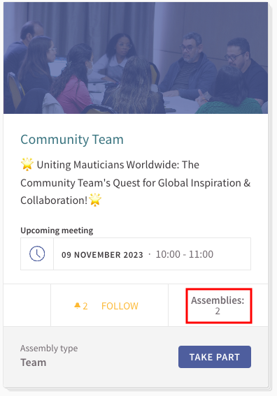
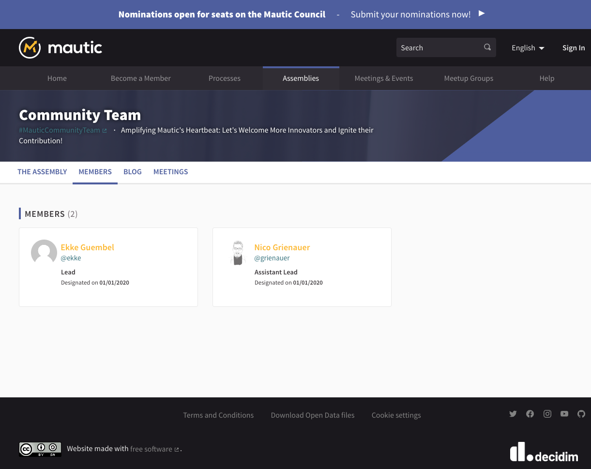
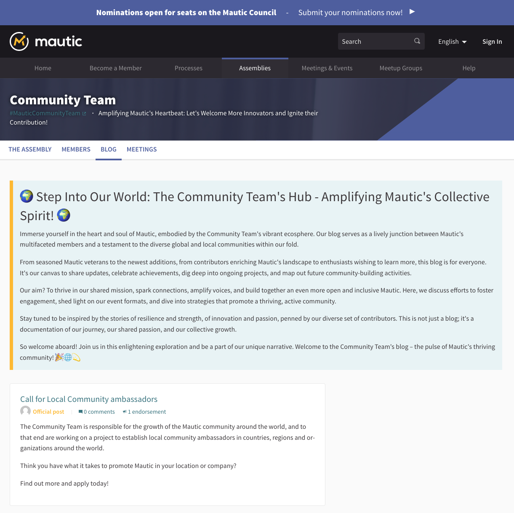
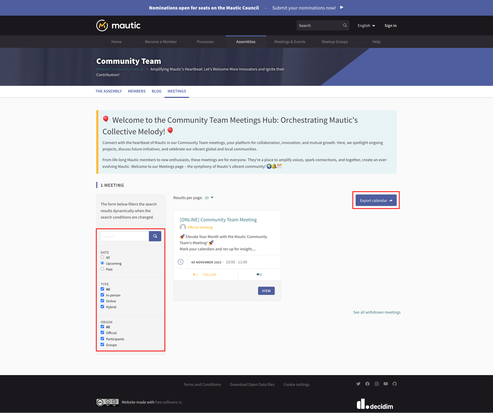
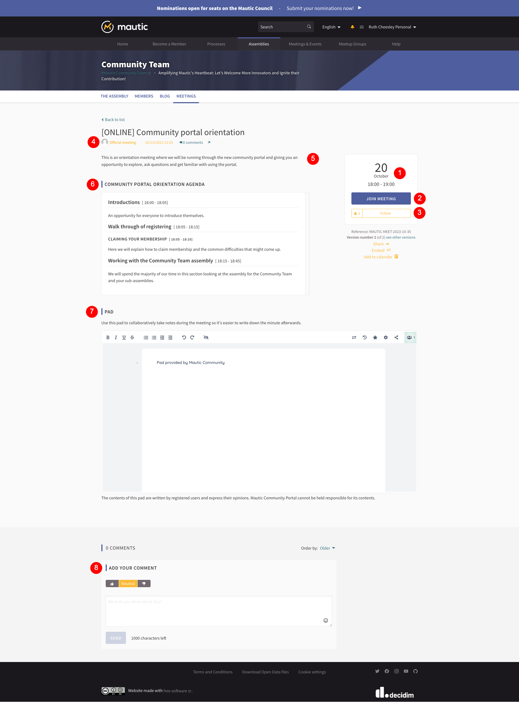
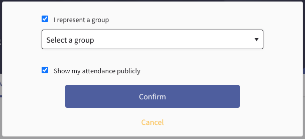
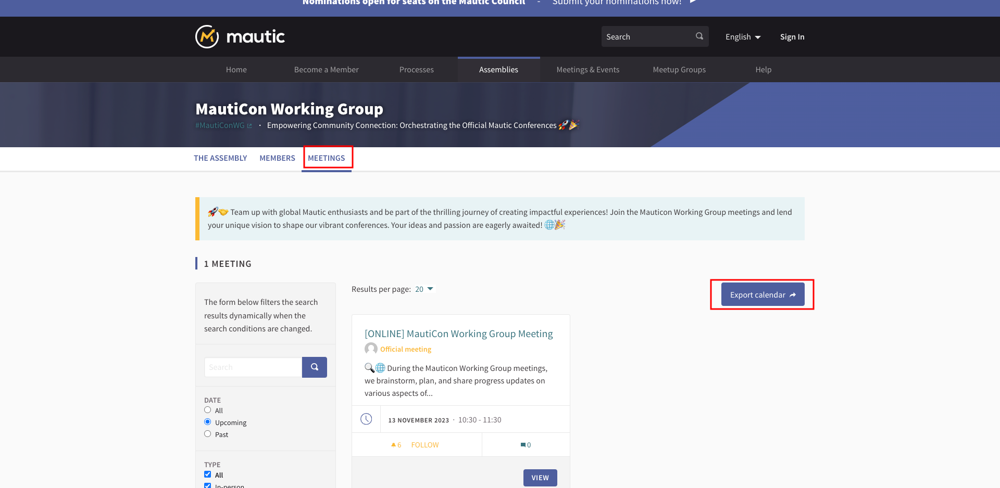
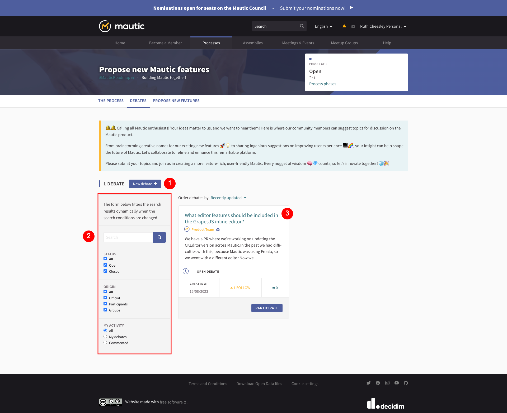
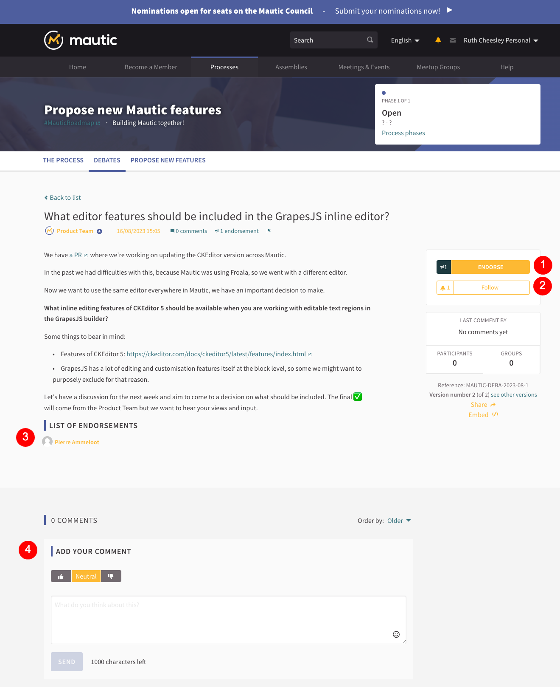

Assemblies
##########

This documentation explores assemblies, what they're, why they're important, why you might want to get involved with using them, and what you can do.

.. vale off

If you prefer to watch this in video form, you can do that here:

.. vale on

.. raw:: html

    <iframe width="560" height="315" src="https://www.youtube.com/embed/fYg8yPQcgxM" frameborder="0" allowfullscreen></iframe>

.. raw:: html

      

Getting started with assemblies
*******************************
.. vale off

You can access assemblies via the link on the main menu. When you visit this page, you’ll notice that some assemblies highlight, followed by the full list of top level assemblies.

.. vale on

An assembly is a grouping of people who come together to make decisions about specific things or to run different parts of the community.

There are different reasons for having assemblies. Some of them relate to decision-making and governance, such as the Council and the General Assembly, while others are for Teams, Meetup Groups, and Working Groups.

An assembly can also contain assemblies within it, for example, the MautiCon Working Group is part of the Community Team, because that's the team in which it belongs. The card shows a stacked appearance and lists the number of assemblies within it, as seen in the Community Team here.

Exploring assemblies
********************
.. vale off

When you click through to an assembly, you are presented with the overview page.

.. vale on

.. image:: ../images/assemblies-overview.png
    :alt: VSCode screenshot showing how to change branches
    :width: 600px
    :align: center

.. raw:: html

      

.. vale off

1. Where it has been set, there's a hashtag which relates to the specific assembly.
2. The main page for an assembly provides an overview, which is basically the charter for that organised group - what they do, and why they exist.
3. If this assembly has a finite time for existence - for example if it exists to support a specific event - this information appears in the metadata on the right-hand side of the page.
4. The follow button is common across the whole of the community portal, allowing you to get updates from assemblies, groups, processes and so forth by clicking the button. Think of it as similar to following on social media pages
5. Each assembly has a sub-menu with different components based on the assembly's needs.
6. Any upcoming scheduled meetings appear in a list, and where an option exists, you can join the meeting by clicking through. After meetings, you can view minutes and notes.
7. If an assembly has sub-assemblies, they appear in this section. Remember, assemblies and sub-assemblies can contain other assemblies.
8. At the bottom of the page, you'll find statistics about the assembly.

.. vale on

Members
*******

.. vale off

An assembly has formal roles including:
- Lead
- Assistant lead
- Contributor
- Custom defined roles

.. vale on

When you click the members item in the assembly menu it lists the formal members.

.. raw:: html

      

.. vale off

If you want to stay informed about an assembly, the best thing to do is to follow that assembly to get updates. When you start practically contributing to an assembly in some way, the team designates you as a contributor or the relevant formal role for the assembly.

.. vale on

Blog
====
In the Community Team, a blog is available. Anything across the whole of the community portal can have a blog and they all get output into the activity feed, so it's a great way of keeping people apprised of what your team is working on and what your project is doing.

In this case, an official post from the team invites people interested in promoting Mautic in their local regions to become ambassadors and express their interest.

Meeting
=======

.. vale off

Another popular component used in the portal is meetings. Meetings can be online, hybrid, or in person, and there is an option to filter using select boxes and a search box to show all meetings, upcoming meetings, past meetings, and also to filter by type.

.. vale on

There is an option to export the calendar, which is great if you want to ensure that the meetings for a particular assembly are in your personal calendar. This creates a URL which you can subscribe to in your calendar of choice, so it's updated automatically.

.. raw:: html

      

Click the meeting to see what people are discussing.

.. raw:: html

          

1. On the right-hand side, you'll see the date and time for the meeting.

.. vale off

2. There is a button to join the meeting, which allows you to decide whether you want your participation to be shown publicly or not, and also whether you are representing a group or yourself. Sometimes a meeting uses an external ticketing system, in which case 'join meeting' takes you to that system to complete the form. After registering, you gain access to the link for the online or hybrid meeting.

.. vale on

.. raw:: html

      

3. You can decide to follow the meeting if you want to get updates.
4. In some assemblies, participants can create meetings as well as the group members. You can tell the difference when a group member creates a meeting, it appears as an official meeting.
5. A description of the meeting gives you an overview of what’s discussed.
6. A formal agenda outlines what’s discussed and the rough timings for each section.
7. An Etherpad which allows you to take notes collaboratively during the meeting. The pad becomes editable within 24 hours of the meeting start time and remains available and editable for 72 hours after. From that point it becomes read only. This allows people to participate asynchronously if they want to. It's required to log into the portal to edit the Etherpad.
8. You can leave comments on a meeting and choose to show positive support, stay neutral, or downvote, along with your comment if you wish. There is a maximum of 1,000 characters per comment.

Subscribing to the calendar
---------------------------
To subscribe to an Assembly's calendar, click the Meetings link in the Assembly menu, then click Export Calendar. This provides a link for you to add the Assembly calendar in your tool of choice.

.. raw:: html

      

To subscribe to all events site-wide, follow the same process but use the Meetings & Events menu item on the main menu.

Debates
=======

.. vale off

In the new features process, the component for debates is included. Any of the assemblies or processes can have the debates component available.

.. vale on

If you have a question, and you want the community to be able to give you feedback or discussions, this is a great way to do it within the community portal.

.. raw:: html

      

1. Button to create a new debate.
2. Search and filter options to look through all debates.
3. Individual debates

In this case, the team was working on CKEditor, and a question arose about what should be changeable in the WYSIWYG editor when using the GrapesJS Builder. Since many things can change directly in the GrapesJS Builder, the question is how much control you should give to the WYSIWYG editor. This presents an opportunity for discussion and debate.

.. raw:: html

      

1. Button to endorse the debate as yourself or as a group or team.
2. Button to follow the debate and get notifications about any changes.
3. A list of individuals and teams or groups who have endorsed the debate.
4. An opportunity to give positive, neutral or downvote support and leave a comment with up to one thousand characters.

Debates could be time limited, or they could close them  when the discussion gets to a point where participants make a decision, and then if appropriate a related proposal can follow.