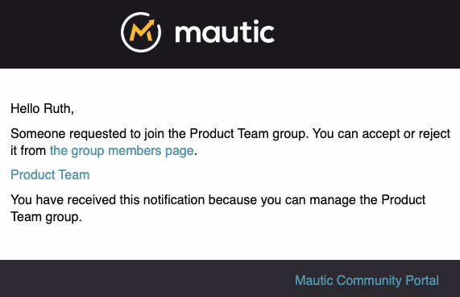
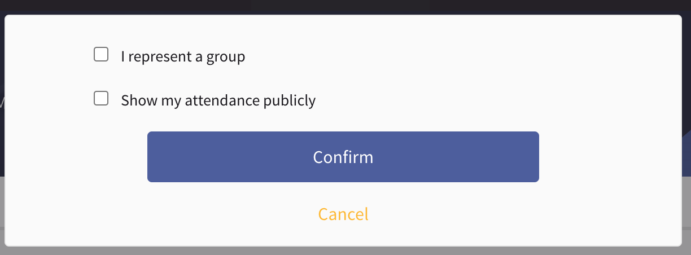

Groups
######

Groups in Decidim serve several purposes:

* To allow you to participate on behalf of an entity - for example joining a meeting or endorsing a proposal on behalf of your team
* To allow groups of people to automatically join an assembly by virtue of their group membership
* To allow groups of people to have conversations together

Joining a group
***************

If you would like to join a team, working group or other entity within the community, the first step is to request to join the group. This allows you to become a member of the connected assembly as a contributor, when approved.

#. Find the group you want to join - either via the assembly homepage, or by [searching for the group](https://community.mautic.org/search?filter%5Bterm%5D=&filter%5Bwith_resource_type%5D=Decidim%3A%3AUserGroup&filter%5Bwith_scope%5D=).
#. Click to request to join the group, and wait for request approval:

  .. image:: images/request-to-join-group.png
    :width: 800
    :alt: Request to join a group

Accepting a member request
**************************

When a new member requests to join a group which you are an administrator of, you receive notification in-app and by email:

.. image:: images/notification-inapp-group-join-request.png
  :width: 800
  :alt: Inapp notification from a user to join the group

|

Use the link in the notification to jump straight to the request, and click Accept to allow the request, or reject to prevent the user joining the group.

.. image:: images/request-to-join-group-accept-reject.png
  :width: 800
  :alt: Reject a user to join the group

On approval, they're added to the group and any related assemblies.

Managing members
****************

If you need to promote a member to an administrator of a group, or remove a member, click Manage Members within the group, and then click the relevant button.

.. image:: images/group-manage-members.png
  :width: 800
  :alt: Manage group members

Creating a group
****************

Individuals have to create Groups rather than via the administrator portal, and are then verified by the Community Portal Working Group.

#. Go to your public profile, via the user menu.

#. Click on 'Create group' at the bottom left of your user profile:

   .. image:: images/create-group-button.png
     :width: 800
     :alt: Create group button

#. Use the team email address with your group as a suffix - for example community-team+portalwg@mautic.org - the team receives and confirms via email.

#. For official groups, use the Mautic logo for the avatar.

#. Click 'invite participants' to add other members - you need to know their nickname for the community portal, from their profile:

   .. image:: images/invite-participant-group.png 
     :width: 800
     :alt: Invite participants link

#. Ensure that you add at least one other administrator, ideally someone from the [Community Portal Working Group](https://community.mautic.org/assemblies/community-portal-working-group/members).

Once created, you can find groups via the Groups menu or when [searching and filtering by Groups](https://community.mautic.org/search?filter%5Bterm%5D=&filter%5Bwith_resource_type%5D=Decidim%3A%3AUserGroup&filter%5Bwith_scope%5D=).

Official groups have a blue circle with a white star inside to signify their status.

.. image:: images/official-groups.png 
  :width: 800
  :alt: Offical groups list

Adding a group as a member of an entity
***************************************

You can add a group in the same way you add a user to an assembly, process, etc. by logging in as an administrator, going to the entity in the administrator panel and going to Members > Add new member and typing the group name.

Remember that adding the group means that **all members** of the group become a member of that entity immediately.

Acting on behalf of a group
***************************

When you are an administrator of a group, you have the ability to act on behalf of a group. This might include:

* Attending a meeting or event on behalf of a group
* Endorsing a proposal on behalf of a group

When eligible, a checkbox displays when registering to attend a meeting or endorsing a proposal for example, which allows you to take action on behalf of the group:

By checking the box, the group name - rather than your name - shows in relation to the action - for example as an attendee of a meeting, or endorsing a proposal.
