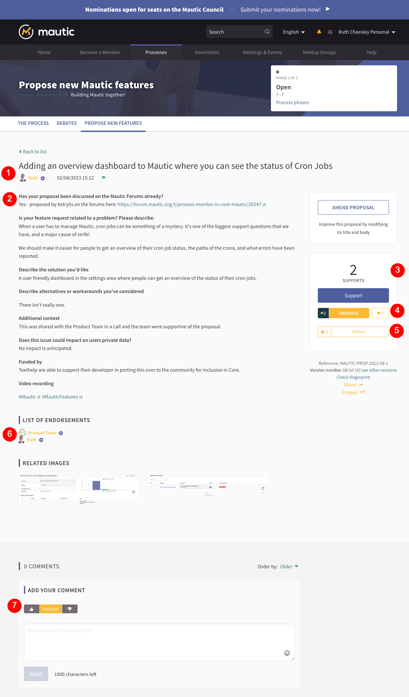

Processes
#########

This article explores Processes in the new Mautic community portal, what are they, reasons for their use, how you use them, and why they're important in the Mautic community.

If you prefer to watch this in video format, you can do so here:

.. raw:: html

    <iframe width="560" height="315" src="https://www.youtube.com/embed/k_f9u1nTlvE" frameborder="0" allowfullscreen></iframe>

.. raw:: html

      

Navigate to Processes in the top main menu. Introductory text explaining the concept of a participatory process appears at the top, similar to what was present in Assemblies.

What's a participatory process?
*******************************

Basically, it's a sequence where someone makes a proposal, the community reviews it, then votes or prioritizes, and finally decides on the course of action.

Processes apply to anything from voting on Council members, to deciding on new Mautic features, to choosing swag for the next MautiCon and having people design proposals. The community votes on submitted proposals, and the highest-voted options move forward for implementation.

There are many ways to apply participatory processes within the community. Currently, two processes are active. The council elections process serves as the first example, as it is likely the easiest to understand.

Voting endorsing
****************

Voting is where the system formally counts your vote, but endorsing is just showing that you like this proposal. It's akin to a like on social media, whereas voting is actually casting a vote for that proposal.

You are able to vote for the proposal as an individual human, and each process may restrict the number of votes that are available per user.

Endorsing can be done on behalf of you as an individual human, but also on behalf of a team or a group. For example you might endorse a proposal on behalf of the Product Team or the Core Team.

Council elections process
*************************

To get to the processes, click on the main menu, then click on the Elections process.

1. A hashtag which relates to this specific process.
2. About participatory processes - you can cancel that if you don't want that to show every time.
3. What this process is about, why it is important.
4. This tells you about the council. What's the council? Why is this election happening? What's the council's role within our community?
5. Like everything else, you can stop following or follow here using this button.
6. This process belongs to a process group called governance. Elections may be running alongside other governance-related processes. So this allows us to group active processes together.
7. If there are assemblies that are related to this process they will be listed here.
8. More information about the process can be found in the metadata.
9. The phases of the process will be listed here.

So what happens with a process, which is different to an assembly, is there are distinct phases. So you'll see at the top of the screenshot above it says we're in phase one of three. The team organizing the process defines these phases when setting up the process. In this case, we've got three phases.

.. image:: images/process-phases.png
    :alt: Screenshot showing Mautic council election process
    :width: 600px
    :align: center

.. raw:: html

      

So here we've got nominations open until the end of October. And this is a phase where you could step up and say, I want to stand as a member for the Council. You can propose yourself to actually be considered for nomination for voting for a Council member position. This phase, which will start on the ``28th of October`` and go through to the ``8th of November`` is where all of the nominations are now submitted.

When nominations close, the process stops accepting new nominations, and the community can vote for their preferred candidates for the Council. Each member of the General Assembly gets seven votes, corresponding to the seven available seats on the Council. If 15 people stand for election, each voter has seven votes, so the final result will rank candidates based on the number of votes they receive.

And then on the ``8th``, the outcome of the nomination and election process is then announced to the community.

In the voting phase, the system displays nominations randomly. During the announcement, it lists them by the highest number of votes.

Creating a proposal
*******************

If I wanted to nominate myself, I would follow this process:

.. image:: images/submit-proposal.png
    :alt: Screenshot showing Mautic council election process
    :width: 600px
    :align: center

.. raw:: html

      

1. Click on submit nomination.
2. Review the help text, which changes with each stage.
3. Work through the stages, including comparing what you have proposed with existing proposals.
4. Fill out all the required fields in the proposal.

Once you have completed your proposal, you will have the opportunity to preview it before you publish it for people to review, endorse and vote on.

New features process
********************

The other process involves proposing new features.

The way this works is that when we've been discussing a new feature on the forums and the community has got to a point where both marketers and developers are in agreement that it is something that should come into Mautic and there is commitment to actually developing it, a formal proposal is made for the Core Team to consider.

.. raw:: html

      

1. Title of the proposal and person proposing
2. Standard set of questions which the proposer answers
3. Number of votes that are already existing and option to support the proposal
4. Number of endorsements and comments and option to endorse
5. Option to follow the proposal to receive updates
6. A list of people, teams and groups who have already endorsed the proposal - note that individuals can select to not be displayed publicly
7. Option to leave comments with positive neutral or downvote sentiment

This should clarify how the processes work. We're currently exploring small areas, but there are many other ways these features can benefit Mautic. For now, we’re focusing on two areas where they would be particularly valuable.