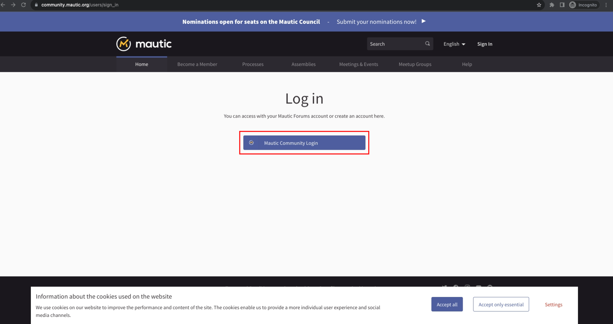
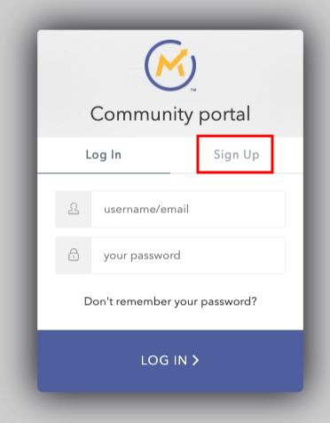
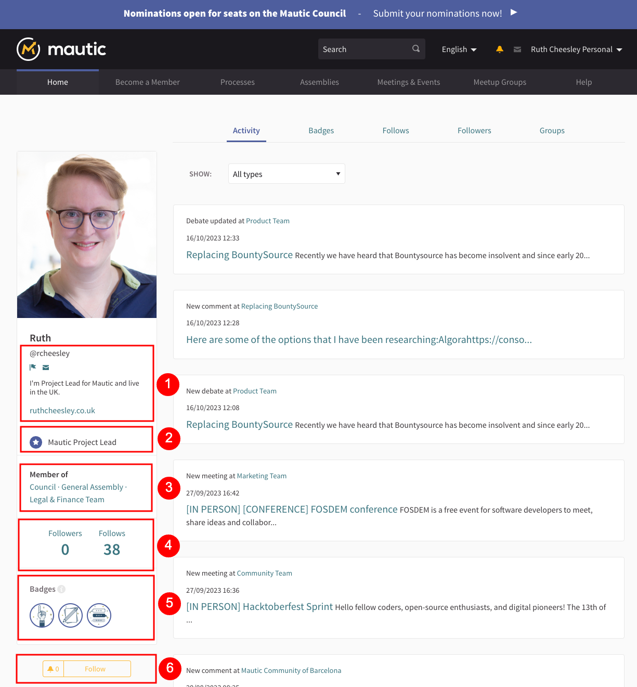

In this article, learn how to sign in and set up your user profile. 

If you prefer you can watch this in the following video:

<iframe width="560" height="315" src="https://www.youtube-nocookie.com/embed/GWc9ocTGwoc?si=BbjWOD3u68Hwf-Rk" title="YouTube video player" frameborder="0" allow="accelerometer; autoplay; clipboard-write; encrypted-media; gyroscope; picture-in-picture; web-share" allowfullscreen></iframe>

## Logging in

The first thing to mention is that with the new Mautic Community Portal, you can use your existing forum username and password. So if you click this button, it opens up the dialog to allow you to log in with your Mautic Community Forum login.

If you don't yet have a login, it allows you to create one, and you can then use those credentials on the forum as well. 

If you can't remember your password you can use the option to send a password reset request. If you have problems creating an account, make sure you are using a unique username, name and email. If you still get stuck, please ask in #community on [Slack](https://mautic.org/slack).

### Accepting the terms and conditions

The first time you log in - and any time thereafter when there have been substantial changes to the terms and conditions - you must accept them before you proceed. To do this, review the terms and conditions and, at the bottom of the page, click 'I agree with these terms'.  You can't continue using the platform if you refuse the terms,  and a popup gives you the option to delete your account if you wish.
 
 
 
Certain cookies permit functionality on the Portal which you can choose to accept or reject on the cookie popup. It's important to understand that certain features such as embedded note taking won't work if you don't accept the relevant cookies. A prompt notifies you of this if you come across resources like this, to review and update your settings to use that feature if your current setting restricts it.

### Setting language preferences

At the top of the page, you'll notice that there are different languages available if you prefer.  Select the language you wish to use and the interface changes into that language. It's worth noting that some aspects of the website may not be fully translated because they're community created, and as a result may only be available in the language they were originally created in. If you would like to help with translating more of the content please post in #translations on [Slack](https://mau.tc/slack-invite).

### Setting your timezone

It's important to set your timezone, because then events will show on the portal at your local time. To do this, log in and click on 'My Account' under your avatar in the top right.

Scroll to the bottom of the page, and select your timezone from the dropdown. Dates and times will now show in your local timezone.

## Claiming membership

Once logged in you have the option to claim a Mautic membership.   

There is a [membership option](https://mau.tc/membership) as a way to support the Mautic community while also being able to join in with governance processes like voting. You can become an individual member for $100 a year or a pro rated amount based on where you pay taxes, and you can become a corporate member. Read more about the membership program [here](https://mau.tc/membership) and explore the perks of corporate membership in this [handy PDF](https://mau.tc/corporate-tiers).

If you are already a member of Mautic,  you can select this option to match up your membership with your account on the community portal. This allows you to participate in votes, engage in the General Assembly, create proposals, and so forth.

You can watch more about claiming your membership status in this short video:

<iframe width="560" height="315" src="https://www.youtube-nocookie.com/embed/9kOa759Y4eQ?si=RcIe9RLqDpW0GWqW" title="YouTube video player" frameborder="0" allow="accelerometer; autoplay; clipboard-write; encrypted-media; gyroscope; picture-in-picture; web-share" allowfullscreen></iframe>

Mautic maintains a list of who is actually an active member at this point in time, synchronized on a weekly basis. 

### Unable to claim membership

If you're a member and you're not able to claim your membership as you would expect, please drop a message on Slack in the community channel, because it might be that the email address you used when you paid on Open Collective doesn't actually match the email address that you use on the community portal.

Some manual tweaks can fix this quickly, so drop a message in the channel and the team can take a look. 

## Managing your account

Check the dropdown menu item underneath your name. This allows you to customize your account, your public profile, and also see notifications and direct messages. If you're an administrator, you access the administrator portal here, too.

### My Account

This is where you can configure your avatar that others see in the portal whenever you engage here. You can configure your email address and all of your details and which locale you prefer to browse the website using. 

### Notifications

The notification settings is important. This allows you to actually control what you get notified about within the community and how frequently.

You can select or deselect the things that you would like to receive notifications about. You can choose if you get a daily summary email, a weekly summary email, real time or no updates by email. Daily or weekly would be a good option.

#### Updates

Updates is a bit like a newsletter feature. The community may send an update every now and then by email. If you want to receive those, then you can select that here. 

### Direct messages

Do you want to allow anyone to send you a direct message? This allows anyone to send you a direct message on this platform, even if you don't follow them.

Deselect the option if you only want people that you follow to send you a direct message. 

### My Interests

This allows you to decide what topics you'd like to see in your timeline. It's recommended to leave them all selected and if it becomes too noisy you can turn them off in the future. 

### My Data

The 'My Data' section allows you to download all the information held on you in this system, and to delete your account.

## My Public Profile

Under 'My Public Profile' in the top user menu, this is what your profile looks like to the public. 

### Timeline

This shows all of the ways in which you have engaged across the portal by time, with a dropdown filter that allows you to only show certain types of activity. This section **isn't** visible to any other user than the logged in user themselves, because it can also contain items that should be visible only to that participant.

### Activity

Activity is showing the activity that you're involved in. This might include endorsing/supporting proposals, commenting on/creating resources, and so forth. Again it's filterable by type, but this shows on your public profile and other people can see it.

### Badges

For those of you who like gamification, there are lots of badges available. Each badge explains how you can earn the badge, and there's different levels as well. Som have fun engaging in the platform and earning those levels.

### Follows and followers

The follows tab shows the resources and individuals that you follow. Following a participant or a group means that you receive notifications about the activity done by those participants or groups on the platform.  Depending on settings you may also need to follow someone to direct message them.

The followers tab shows a list of participants and groups which follow your user account.

### Groups

The group section contains all the groups that you belong to. For more information on groups refer to the [dedicated page][https://contribute.mautic.org/community-portal/groups].

##  Understanding the fields on the user profile

When viewing a profile in the front end, there are some fields on the left hand side underneath the avatar. Here's what they mean.

1. Username and profile fields
2. Official role within the project
3. Assemblies where they are an official member, such as a team lead, an assistant team lead or a contributor
4. The number of resources and people that they follow, and that follow them
5. The badges that they have earned
6. A button to follow the individual which means that you're updated on every activity that they take part in
