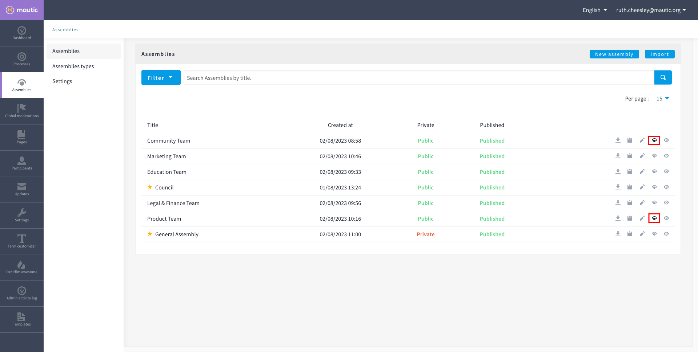
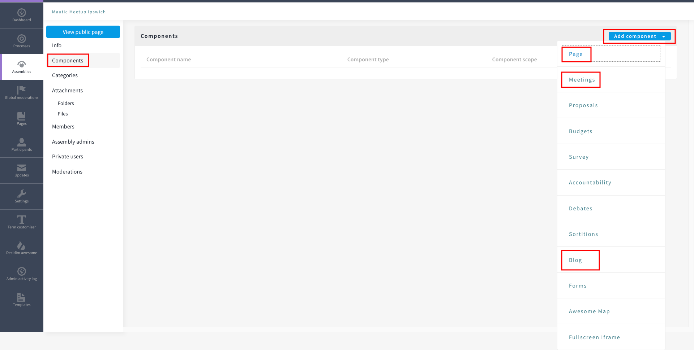
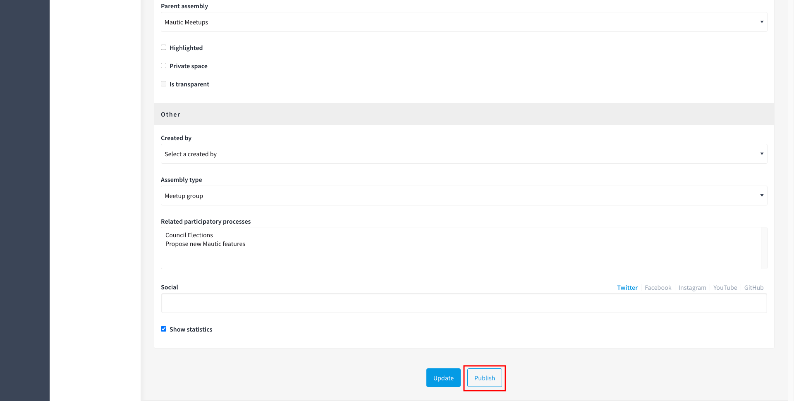

An assembly is a grouping of people who come together to make decisions about specific things or to run different parts of the community.

There are different reasons for having assemblies. So some of them are relating to decision making and governance - such as the Council and the General Assembly - but there are also assemblies for Teams, Meetup Groups and Working Groups as well.

An assembly can also have assemblies nested within it - for example the MautiCon Working Group sits within the Community Team, because that's the team in which it belongs. 

>>> The main difference between participatory processes and assemblies is that assemblies don’t have phases, meaning that they don’t have timelines.

## How to create a new assembly

The first step before you create an assembly, is to decide what the parent assembly should be.

The following top-level assemblies exist:

* Community Team
* Education Team
* Legal and Finance Team
* Marketing Team
* Product Team
* Council
* General Assembly

Think carefully before you create a new top-level assembly - usually it should nest within one which already exists. Remember that you can create assemblies within assemblies at any level of nesting - for example:

_Community Team > Mautic Meetups > Mautic Meetup city_

Once you have decided where the new assembly should sit, follow this process to create the assembly:

1. Log in as an administrator at [https://community.mautic.org/admin](https://community.mautic.org/admin)
2. Browse to the Assemblies section in the administrators portal
3. Find the assembly which you want as your parent assembly - note that this icon is black if there are sub-assemblies within the assembly, clicking it reveals the list of sub-assemblies.

4. Click on the assemblies icon as before, representing the parent assembly
5. Click on 'new assembly' - in the earlier example, when creating a new assembly within the Mautic Meetups assembly, the parent assembly - Mautic Meetups - is within the Community Team assembly. So first navigate to the sub-assemblies of the Community team, then the sub-assemblies of the Mautic Meetup assembly, then click New assembly.

6. Complete the form
  * Check the[ Decidim docs](https://docs.decidim.org/en/develop/admin/spaces/assemblies#_new_assembly_form) for an explanation of the fields.  
  * Please follow existing naming conventions when it comes to the URL slug and hashtag.
  * Please use [this template](https://www.canva.com/design/DAFvp3RX9E4/t7lTTciFvSBcdA_94XbTiQ/view) to create the image for the assembly on Canva.
  * Please select the scope that relates to the top-level assembly for your assembly - for example for Mautic Meetup groups this would be Community Team. This helps with searching and filtering.
  * Please don't highlight the assembly unless agreed with the Community Portal working group.
  * If your assembly needs to be invite only as far as who can engage in it, you should set it to private. This means you have to maintain a list of '[private participants](https://docs.decidim.org/en/develop/admin/spaces/assemblies/private_participants)' who can engage in the assembly. This is quite an overhead, and individuals may also need adding as a member of the group as well to engage in activities, so only use this where absolutely essential. The General Assembly uses this for example. If required, it's highly recommended that you also set the assembly to transparent, so that the community can _see_ what happens in the space, if they can't engage. Private participants receive an invitation to join the assembly, which they must accept. Ensure you use the same email address they use on the portal, otherwise duplicate accounts can arise.
  * Ensure you select the assembly type from the dropdown options.

7. Once saved successfully, go back to the list and you'll notice it's showing as unpublished.

8. Click the pencil icon to configure the assembly
9. Add the components you require by clicking on components > Add Component - generally most assemblies require:
  * Page - to explain in more detail what they do
  * Meetings - for online/hybrid/in-person meetings
  * Blog - to communicate with the community what your assembly is doing

10. Add the Lead, Assistant Lead and any contributors under the Members section by searching for the existing user. Note you can also create your own role name using 'other' as the option when selecting a role.
11. If you want people to be able to become a member of your assembly _without_ you needing to manually add them, you can create a group which they can join, automatically granting them membership to your assembly. Check the [documentation on groups](https://contribute.mautic.org/community-portal/groups) for how to create them, and then add the group in the Members section as previously described.
12. Add any assembly admins - this gives the user full administrator rights over only this specific assembly. You need to know the email address they use, which you can find via Admin panel > Participants > Participants > Show email address - the icon resembles an open envelope.
13. Once configured, go to Info on the left menu when configuring the assembly, and click the Publish button at the very bottom of the page.

13. If the assembly is private, you'll need to invite members in the 'private members' section, once published.

### Assembly types

Currently the following assembly types are available:

* Team
* Working group
* Tiger team
* Governance
* Meetup group