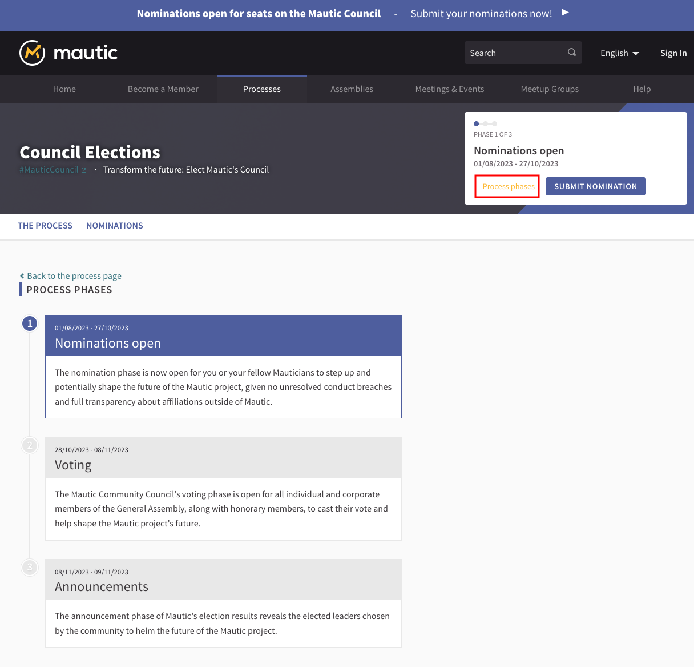
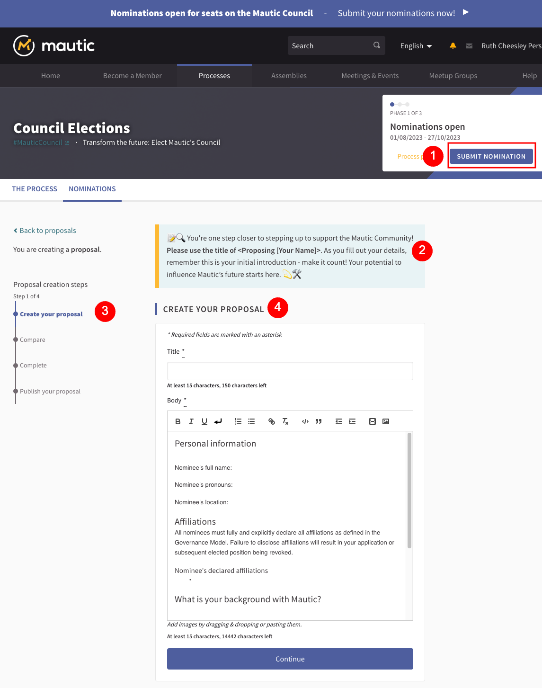

In this article, we're exploring Processes in the new Mautic community portal - what are they, why we would use them, how you use them, and why they're important in the Mautic community. 

If you prefer to watch this in video format, you can do so here:

<iframe width="560" height="315" src="https://www.youtube-nocookie.com/embed/k_f9u1nTlvE?si=Td4qjyEt4RJqxvvh" title="YouTube video player" frameborder="0" allow="accelerometer; autoplay; clipboard-write; encrypted-media; gyroscope; picture-in-picture; web-share" allowfullscreen></iframe>

So let's go ahead and click on Processes in the top main menu, and you will notice that there's some text at the top, just like there was in Assemblies, which explains to you what a participatory process is.

## What is a participatory process?

Basically, it's a sequence where you go through making a proposal, the proposals are reviewed, they're voted on or prioritized, and then we make a decision on what to do. 

Processes could be used for anything from voting on who's going to be on the Council, to deciding new features in Mautic, to figuring out what kind of swag we're going to have for the next MautiCon and having people design some proposals, and we then ask the community to vote and then decide which ones we go forward with.

So you can see there's lots of different ways that we might use a participatory process within the community. At the moment, we have two processes that are live, and I'm going to talk you through the council elections one to start with, because that's probably the easiest for people to understand.

### Supporting v endorsing
Supporting is voting, but endorsing is just showing that you like this proposal. It's akin to a like on social media, whereas supporting is actually casting a vote for that proposal. 

You are able to support the proposal as an individual human, and each process may restrict the number of supports that are available per user.

Endorsing can be done on behalf of you as an individual human, but also on behalf of a team or a group.   For example you might endorse a proposal on behalf of the Product Team or the Core Team.

### Council elections process

To get to the processes, click on the main menu, then click on the Elections process.

1. A hashtag which relates to this specific process.
2. About participatory processes - you can cancel that if you don't want that to show every time. 
3. What this process is about, why it is important. 
4. This tells you about the community council. What is the council? Why is this election happening? What is the council's role within our community?
5. Like everything else, you can stop following or follow here using this button. 
6. This process belongs to a process group called governance. So we might have the elections running, but there might also be some other processes that are running which also relate to governance. So this allows us to group active processes together.
7. If there are assemblies that are related to this process they will be listed here. 
8. More information about the process can be found in the metadata.
9. The phases of the process will be listed here.

So what happens with a process, which is different to an assembly, is there are distinct phases. So you'll see at the top of the screenshot above it says we're in phase one of three. These phases are created when we create the process, and they can be specified by the team that are organizing the process. In this case, we've got three phases.

So here we've got nominations open until the end of October. And this is a phase where you could step up and say, I want to stand as a member for the council. You can propose yourself to actually be considered for nomination for voting for a council member position. This phase, which will start on the 28th of October and go through to the 8th of November is where all of the nominations are now submitted.

When the nominations close it means that we don't allow any more nominations, and the community have the option to vote for who they want to be standing on the council. So every member of the General Assembly will have seven votes to vote for people in the nominations, because there's seven seats on the council. So if we had 15 people stepping forwards and you have seven votes, obviously you can see that they  we will figure out in the end that some people will be more highly ranked than others.

And then on the 8th, we will then make the announcement and tell people what the outcome is of this nomination and election process. 

In the voting phase, the nominations will be shown randomly and then when we get to the announcements, they will be shown by the highest number of votes.

#### Creating a proposal

If I wanted to nominate myself, I would follow this process:

1. Click on submit nomination.
2. Review the help text, which changes with each stage.
3. Work through the stages, including comparing what you have proposed with existing proposals.
4. Fill out all the required fields in the proposal.

Once you have completed your proposal, you will have the opportunity to preview it before you publish it for people to review, endorse and vote on.

### New features process

The other process that we have is proposing new features. 

The way this works is that when we've been discussing a new feature on the [forums](https://forum.mautic.org/c/ideas) and the community has got to a point where both marketers and developers are in agreement that it is something that should come into Mautic and there is commitment to actually developing it, a formal proposal is made for the Core Team to consider. 

1. Title of the proposal and person proposing
2. Standard set of questions which the proposer answers
3. Number of supports that are already existing and option to support the proposal
4. Number of endorsements and comments and option to endorse
5. Option to follow the proposal to receive updates
6. A list of people, teams and groups who have already endorsed the proposal -  note that individuals can select to not be displayed publicly
7. Option to leave comments with positive neutral or downvote sentiment

So hopefully that makes sense as to what the processes are, how they work. We are just exploring very small areas right now, and there are lots of other ways we can use these features for the benefit of Mautic, but we're just starting in two areas where we think that it would be really beneficial. 