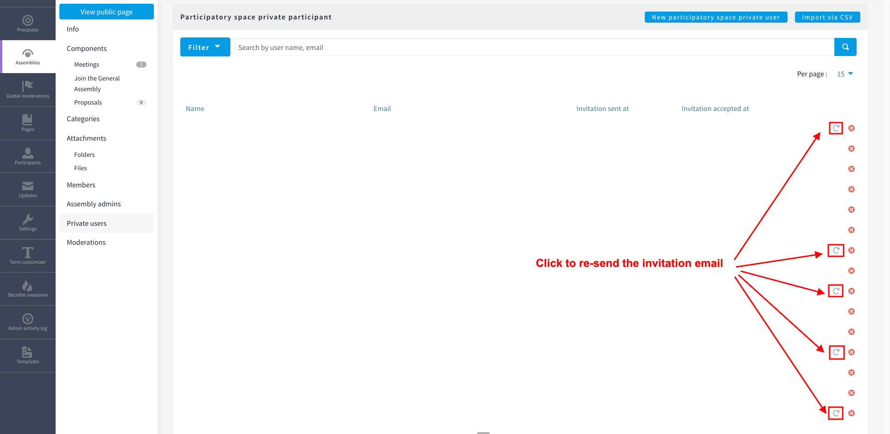

Certain areas of the Community Portal have features restricted to members of Mautic's General Assembly - for example to interact in the General Assembly, to nominate and vote on proposals for elections, and so forth.

Membership is managed via a list which is regularly uploaded to the Community Portal, containing the currently active members.

## Uploading the list

This is currently a manual task which is carried out at least once a week, usually on a Friday.

1. Download [transactions](https://opencollective.com/mautic/transactions) from Open Collective, including the name and email address of the 'opposite account' via a custom export. Filter the list by text in the description field containing 'General Assembly'.
2. Paste the email addresses only (no header row) into the first sheet in [this spreadsheet](https://docs.google.com/spreadsheets/d/1-KEEDalZaFgOJjvs21OIkAnyAYpnny5DGY5T4mgNyqE/edit?usp=sharing) (request access if needed) and go to file>download to export to csv.
3. Upload the csv file under admin panel > membership list > Mautic membership list in the Community Portal.
4. Next we need to add the members to the General Assembly. Copy the email address list into the second tab on the sheet, and then paste the names column from your downloaded transactions into the second column and export the sheet
5. Upload the sheet in Assembiles > General Assembly > Prrivate users > Import via CSV.

6. You may need to manually send invitations using this icon, if the user did not act on the invitation yet.

