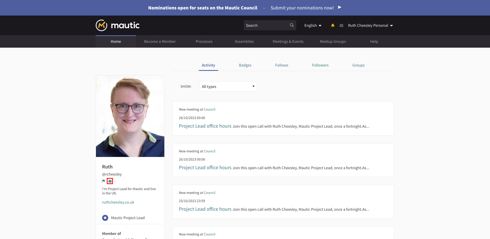

With conversations, participants can communicate privately with each other on a one-to-one basis, or with multiple other individuals or groups. Only the participants who are in the conversation can see each others messages.

A conversation can be started with any participant or group registered on the platform.

Please note that all conversations within this platform must adhere to the [Code of Conduct](https://contribute.mautic.org/policies/code-of-conduct) at all times.

>>> We use [Slack](https://mau.tc/slack-invite) as our primary tool for conversations within the community on a 121 and group basis, so we'd recommend that you use Slack rather than the Community Portal at this time.

To start a conversation:

1. Sign in to the Community Portal
2. Go to the participant profile that you want to start a conversation with
3. Click the contact icon

4. Type your messsage, up to 1,000 characters. The user will receive a notification in-app and via email (per their settings).

Alternatively, you could also:

1. Sign into the Community Portal
2. Click on the conversation icon in the header (envelope icon)
3. Click on the "Start conversation" button
4. Search the participant or group that you want to start a conversation with
5. Type the message

If there are new messages in a conversation, then the participant will see the envelope icon in their user menu turn gold.

### Conversations with multiple people

It’s possible to have multiple participants in a conversation.

For this, you need to follow the same step via the conversations icon in the main menu, but this time invite up to nine people to the conversation.

## Group conversations

Just like with participants, is possible to have conversations with groups.

To encourage free conversation and engagement, any individual can communicate with any group by sending them a message, and a group can start a conversation with up to nine participants. As we currently use Slack for collaboration, we don't encourage using this facility for discussion purposes and would encourage you to post in the relevant Slack channel instead.
