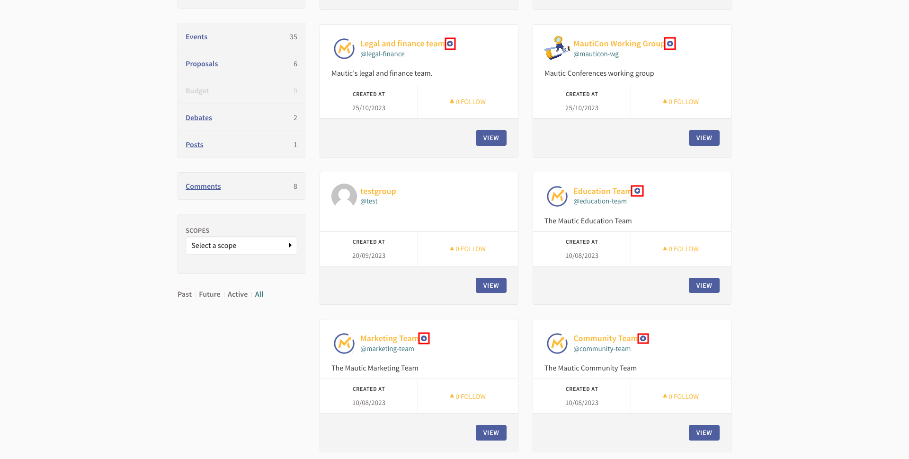

Groups are used in Decidim for several purposes:

* To allow you to participate on behalf of an entity (for example joining a meeting or endorsing a proposal on behalf of your team)
* To allow groups of people to automatically join an assembly by virtue of their group membership
* To allow groups of people to have conversations together

## Creating a group

Groups have to be created by individuals, and are then verified by the Community Portal Working Group.

Once created, groups can be found via the Groups menu or when [searching and filtering by Groups](https://community.mautic.org/search?filter%5Bterm%5D=&filter%5Bwith_resource_type%5D=Decidim%3A%3AUserGroup&filter%5Bwith_scope%5D=).

Official groups are indicated by a blue circle with a white star inside.

